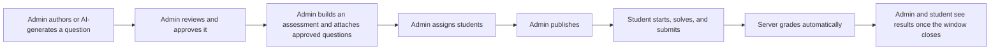

# Client Handoff — Centurion Technical Assessment Platform

## 1. What Was Built

A complete, working technical assessment platform for Centurion University — a purpose-built system for running timed coding exams and multiple-choice quizzes, with an AI assistant to help draft questions faster and a human-approval workflow to keep that AI assistant in check. Built from the ground up as this university's own product, not a third-party tool with limited customization.

## 2. Product Capabilities

- Real online-judge-style coding exams in **Python, Java, and C++**, using an in-browser code editor (the same editor engine that powers Visual Studio Code).
- Multiple-choice exams with single- and multi-answer questions, including optional negative marking.
- Server-enforced timers that cannot be extended by tampering with a student's own device.
- An AI question-generation assistant (powered by Google's Gemini), with every generated question reviewed and approved by a human before it can ever appear on a real exam.
- A complete results system showing scores and a full breakdown per question.

## 3. Admin Capabilities

- Build and maintain a question bank: author coding questions (with public and hidden test cases, and a reference solution) and multiple-choice questions by hand, or generate drafts with AI.
- Review and approve/reject every question — including every AI-generated one — before it can be used in a real assessment.
- Assemble assessments from approved questions, organized into sections.
- Assign specific students, or an entire department/batch at once, to an assessment.
- Publish assessments — the system will not let one go live with missing test cases, unapproved questions, or no assigned students.
- View every student's results and submission history for any assessment, at any time — including while a student's attempt is still in progress.

## 4. Student Capabilities

- See every assessment they've been assigned, with its schedule and status.
- Start an assessment and work through it at their own pace within the allotted time.
- Write and run code in a real editor, test it against sample cases, and submit it for grading.
- Answer multiple-choice questions with immediate save confirmation (never immediate correctness — that would defeat the exam).
- Navigate freely between questions.
- Submit the whole assessment with a clear, deliberate confirmation step.
- View their own result once the assessment's window has closed for everyone.

## 5. Assessment Workflow

Every step above is enforced by the server, not just suggested by the interface — a student cannot start an assessment before its window opens, an admin cannot publish an incomplete assessment, and nobody sees a result before the exam window has closed for the whole group.

## 6. AI Capabilities

The platform can generate draft coding questions on demand — pick a topic, a difficulty, a target language, and how many to generate. Nothing an AI generates is ever shown to a student, or usable in a real exam, until an administrator has reviewed and explicitly approved it — the exact same review process a hand-written question goes through. Every generation attempt is recorded, so there's a full history of what was asked for, when, and by whom. If the AI service is temporarily unavailable, the rest of the platform is entirely unaffected — only that one feature is paused until it's reachable again.

## 7. Technology Architecture

Built on modern, widely-used, well-supported technology: a React frontend, a Node.js/NestJS backend, and a PostgreSQL database — the same category of stack used by a large share of modern web products. Code submissions are compiled and run by a dedicated internal component, kept deliberately separate from the rest of the system and never reachable from outside the university's own server, so that running student-submitted code can never put the rest of the platform (accounts, other students' data, exam content) at risk of a shared failure.

## 8. Deployment Model

The platform runs as a small number of standard server processes behind a standard web server (Nginx) with an HTTPS certificate — no specialized hosting platform or proprietary infrastructure is required. It can run on a single, modestly-sized Linux server for a pilot or a department-scale rollout, and the architecture is designed so that heavier future demand can be met by adding capacity incrementally rather than rebuilding anything.

## 9. What Is Ready Today

- The complete admin and student experience described above, ready to demonstrate or pilot with a real, trusted group of students right now.
- Real security fundamentals already in place: encrypted password storage, automatic account lockout after repeated failed logins, and strict role-based access enforced on every request, not just hidden in the menus.
- A genuine, functioning code judge for Python, Java, and C++ — not a mockup.

**What is not yet ready for large-scale, unsupervised, high-stakes use**: the component that runs student-submitted code has real safeguards (time limits, memory limits, and several other resource controls added in this final phase) but does not yet run inside a fully isolated security sandbox. For a supervised pilot with students who have no reason to attack the system, this is a safe and reasonable way to run real exams. For a large, fully public, high-stakes deployment, closing that last gap is the recommended next investment before scaling up.

## 10. Recommended Future Improvements

1. **Full code-execution sandboxing** — the single highest-value next investment before scaling to a large, unsupervised student population.
2. **Production monitoring** — automated alerts if something goes wrong, rather than relying on someone noticing.
3. **Automated, scheduled backups** of the database, with periodic restore testing.
4. **A class ranking/leaderboard view** — the underlying calculation already exists; it simply isn't shown anywhere yet, and is a comparatively small addition if wanted.
5. **Single sign-on integration** with the university's existing accounts, once that system's own login method is confirmed — the platform's authentication was deliberately built to make adding this later straightforward.
