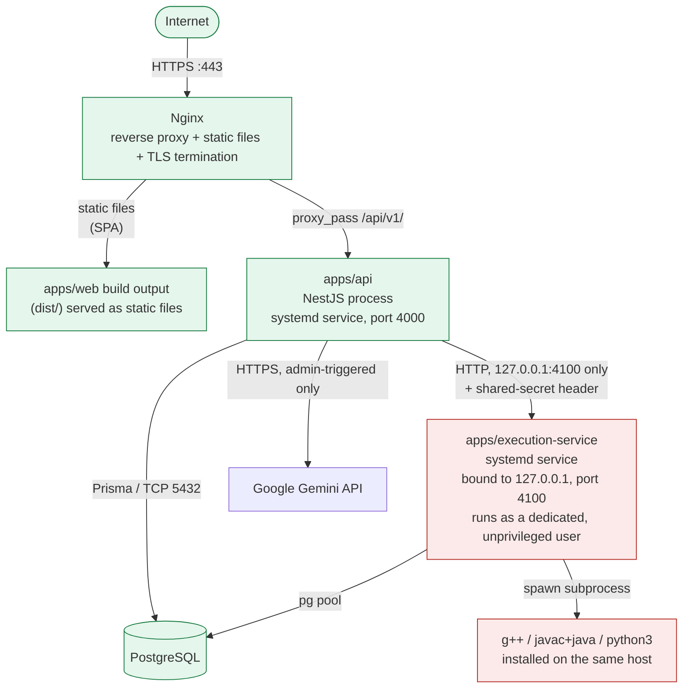

# Deployment Guide — Centurion Technical Assessment Platform

**No Docker. No containers. No Kubernetes.** This platform is deployed as three native Node.js processes plus PostgreSQL, fronted by Nginx. Every command below is either a real script from this repository's `package.json` files or a standard Linux/Nginx/systemd command — nothing invented.

---

## Overview

Four pieces, three of which run as long-lived processes on the server:

1. **Frontend** (`apps/web`) — a static single-page app (Vite build output). Served directly by Nginx; no Node process needed at runtime.
2. **API** (`apps/api`) — a NestJS process. Publicly reachable only through Nginx.
3. **Execution service** (`apps/execution-service`) — a NestJS-free plain Node process that compiles/runs student code. **Never publicly reachable** — bound to `127.0.0.1` and only ever called by the API.
4. **PostgreSQL** — the only datastore. One database, shared by the API and the execution service (each with its own connection).

---

## Architecture



**Public components**: Nginx, the static frontend, the API (only via Nginx, never directly).
**Private components** (never reachable from the internet, ideally not even from other hosts on the same network): the execution service, PostgreSQL.

This is the same architecture whether you run everything on one VPS (§ "Deployment Options" in `docs/PRODUCTION_READINESS.md`) or split components across machines later — only the addresses change, not the shape.

---

## Local Development

Exact commands from the real `package.json` files (see `docs/PRODUCT_GUIDE.md` §3 for the full walkthrough — repeated here for completeness):

```powershell
npm install
Copy-Item "apps\api\.env.example" "apps\api\.env"
Copy-Item "apps\execution-service\.env.example" "apps\execution-service\.env"
# edit both .env files, then:

npm run dev:api                 # terminal 1
npm run dev:execution-service   # terminal 2
npm run dev:web                 # terminal 3
```

On Linux, the same three commands work identically (`npm run dev:api` etc. — they're plain npm workspace scripts, not Windows-specific).

---

## Linux Server Requirements

- **Node.js** — the same major version used in development (check `apps/*/package.json` engines or just use a current LTS; Node 20+ is safe).
- **PostgreSQL** — 14 or newer.
- **Nginx**.
- **A C++ compiler** (`g++`, via `apt install g++` on Debian/Ubuntu).
- **A JDK** (`apt install default-jdk` or a specific vendor's JDK).
- **Python 3** (`apt install python3`).
- **A domain name** pointed at the server, for HTTPS (Let's Encrypt/Certbot needs this).
- **Two dedicated Linux users** (see "Process Management" below): one to run the API, and a **separate, unprivileged** one to run the execution service — this second account is the single most important production hardening step for code execution (see `docs/PRODUCTION_READINESS.md` "Security Scorecard").

---

## Environment Variables

Every variable actually read by the code (see the real `env.schema.ts` files and `.env.example` files — nothing here is invented). Generate real secrets with `openssl rand -base64 48`; never reuse the placeholder values from `.env.example`. As of Phase 15, the API **refuses to start** with `NODE_ENV=production` if a JWT/shared secret still matches the literal `.env.example` placeholder text, or if `FRONTEND_URL` still points at `localhost`.

### `apps/api/.env`

| Variable | Production guidance |
|---|---|
| `NODE_ENV` | `production` |
| `PORT` | `4000` (internal — only Nginx talks to it) |
| `DATABASE_URL` | production Postgres connection string |
| `JWT_ACCESS_SECRET` / `JWT_REFRESH_SECRET` | real, unique, ≥16-char random secrets |
| `JWT_ACCESS_TTL` / `JWT_REFRESH_TTL` | defaults (`15m`/`7d`) are reasonable |
| `FRONTEND_URL` | your real domain, e.g. `https://exams.centurion.example`. Can be a comma-separated list if you serve more than one origin (e.g. `https://exams.centurion.example,https://www.exams.centurion.example`) |
| `TRUST_PROXY_HOPS` | **`1`** once Nginx is the sole direct upstream — required for the login rate-limiter to see real client IPs instead of Nginx's own address |
| `SEED_ADMIN_EMAIL`/`SEED_ADMIN_PASSWORD`/`SEED_STUDENT_EMAIL`/`SEED_STUDENT_PASSWORD` | leave unset in production after the first real admin account exists — these only drive the optional seed script |
| `EXECUTION_SERVICE_URL` | `http://127.0.0.1:4100` |
| `EXECUTION_SERVICE_SHARED_SECRET` | must exactly match the execution service's own value |
| `RUN_RATE_LIMIT_MS` | default `2000` is reasonable |
| `GEMINI_API_KEY` | your real Gemini key, or leave blank to disable AI generation |
| `GEMINI_MODEL` | default `gemini-3.6-flash`, or whatever model you've licensed |
| `AI_GENERATION_RATE_LIMIT_MS` | default `3000` is reasonable |

### `apps/execution-service/.env`

| Variable | Production guidance |
|---|---|
| `NODE_ENV` | `production` |
| `PORT` | `4100` |
| `DATABASE_URL` | ideally a **separate, least-privileged** Postgres role for this service (see `docs/PRODUCTION_READINESS.md`) |
| `EXECUTION_SERVICE_SHARED_SECRET` | must match the API's value exactly |
| `POLL_INTERVAL_MS` | default `500` |
| `CPP_COMPILER_PATH` | e.g. `/usr/bin/g++` |
| `JAVA_HOME` | e.g. `/usr/lib/jvm/default-java` |
| `PYTHON_PATH` | e.g. `/usr/bin/python3` |
| `COMPILE_TIMEOUT_MS` / `RUNTIME_GRACE_MS` / `MAX_OUTPUT_BYTES` / `MAX_STDIN_BYTES` / `MAX_JOB_ATTEMPTS` | defaults are reasonable |
| `MAX_PROCESSES` (Phase 15) | default `128` — kernel-enforced fork-bomb ceiling, Linux only |
| `MAX_FILE_SIZE_KB` (Phase 15) | default `51200` (50MB) — kernel-enforced per-file write ceiling, Linux only |

**Never commit either `.env` file.** The repository's `.gitignore` already excludes `.env*` (keeping `.env.example`), confirmed clean by `git status` throughout this project's history.

---

## PostgreSQL Setup

```bash
sudo -u postgres createuser --pwprompt technical_platform_api
sudo -u postgres createdb --owner=technical_platform_api technical_platform
```

Then, from `apps/api` with `DATABASE_URL` pointed at that database:

```bash
npm run prisma:generate    # generates the Prisma client into apps/api/generated/prisma
npm run prisma:deploy      # applies committed migrations — the PRODUCTION-safe command
```

**`prisma:deploy` (`prisma migrate deploy`), not `prisma:migrate` (`prisma migrate dev`), in production.** `migrate dev` can prompt interactively and, if the database has drifted from the migration history, may offer to reset data — never run it against a database with real student/assessment data. `migrate deploy` only ever applies pending migrations, non-interactively, and refuses if anything looks inconsistent.

Optionally seed a first admin account (do this once, then unset the `SEED_*` vars):
```bash
npm run prisma:seed
```

---

## Build Commands

From the repository root (these are the real root `package.json` scripts):

```bash
npm run build:shared
npm run build:api
npm run build:web
npm run build:execution-service
# or all four in the right order:
npm run build
```

- `apps/api`'s build (`nest build`) emits to `apps/api/dist`.
- `apps/web`'s build (`tsc -b && vite build`) emits static files to `apps/web/dist`.
- `apps/execution-service`'s build (`tsc -b`) emits to `apps/execution-service/dist`.

---

## Frontend Deployment

The frontend is **static files only** — no Node process runs it in production. Copy `apps/web/dist/*` to wherever Nginx serves it from (e.g. `/var/www/technical-platform/web`), and configure Nginx to fall back to `index.html` for any path it doesn't recognize as a real file (see the Nginx config below) — required because this is a client-side-routed single-page app (React Router); without the fallback, a hard refresh on e.g. `/student/attempts/xyz` would 404 at the Nginx layer before React Router ever gets a chance to render it.

Rebuild and redeploy this any time `apps/web` changes; it does not need to redeploy in lockstep with the API.

---

## API Deployment

```bash
cd apps/api
npm run build
NODE_ENV=production node dist/main.js
```

In production, this runs under systemd (see "Native Process Management" below), not by hand in a terminal.

---

## Execution Service Deployment

```bash
cd apps/execution-service
npm run build
NODE_ENV=production node dist/server.js
```

**Critical**: in production this must run as its own dedicated, unprivileged Linux user — never as root, and never as the same user the API runs as. See `docs/PRODUCTION_READINESS.md` "Code Execution Security" for exactly why, and the systemd unit example below for how.

---

## Nginx Configuration

A representative config for one domain fronting both the static frontend and the API (adjust paths/domain):

```nginx
server {
    listen 80;
    server_name exams.centurion.example;
    return 301 https://$host$request_uri;
}

server {
    listen 443 ssl http2;
    server_name exams.centurion.example;

    ssl_certificate     /etc/letsencrypt/live/exams.centurion.example/fullchain.pem;
    ssl_certificate_key /etc/letsencrypt/live/exams.centurion.example/privkey.pem;

    # --- Frontend: static SPA ---
    root /var/www/technical-platform/web;
    index index.html;
    location / {
        try_files $uri $uri/ /index.html;
    }

    # --- API: reverse proxy ---
    location /api/v1/ {
        proxy_pass http://127.0.0.1:4000/api/v1/;
        proxy_http_version 1.1;
        proxy_set_header Host $host;
        proxy_set_header X-Real-IP $remote_addr;
        proxy_set_header X-Forwarded-For $proxy_add_x_forwarded_for;
        proxy_set_header X-Forwarded-Proto $scheme;
        # Cookies (the refresh token) must pass through untouched.
        proxy_pass_header Set-Cookie;
    }

    # The execution service is NEVER proxied here and has no public route —
    # it is only ever reachable from the API process on 127.0.0.1:4100.
}
```

Notes:
- `X-Forwarded-For` is what makes `TRUST_PROXY_HOPS=1` (in the API's `.env`) resolve real client IPs correctly for the login rate-limiter — the two settings are a matched pair; changing one without the other silently breaks IP-based throttling (either trusting nothing, or trusting a client-forgeable header).
- SPA routing (`try_files ... /index.html`) is what lets React Router handle client-side paths like `/student/attempts/:id` on a hard refresh.
- CORS is still enforced by the API itself (`FRONTEND_URL`), independent of Nginx — the two are complementary, not redundant: Nginx controls what's reachable at the network level, CORS controls what a *browser* is allowed to do cross-origin.

---

## HTTPS

Recommended: **Certbot** (Let's Encrypt), the standard free option for a single-domain Nginx setup.

```bash
sudo apt install certbot python3-certbot-nginx
sudo certbot --nginx -d exams.centurion.example
```

Certbot edits the Nginx config in place and sets up auto-renewal (a systemd timer or cron job it installs itself). Verify renewal works once: `sudo certbot renew --dry-run`.

The application itself does nothing to enforce HTTPS or redirect HTTP→HTTPS (confirmed in `docs/PRODUCT_GUIDE.md`'s security audit) — that redirect lives entirely in the Nginx config above (the first `server` block).

---

## Native Process Management

**Recommended: systemd**, not PM2. This is a Linux-server deployment with exactly two long-running Node processes; systemd is already on every mainstream Linux distribution (no extra install), gives real process-group resource limits (`MemoryMax`, `CPUQuota`, `TasksMax` — used below specifically for the execution service), integrates with `journalctl` for logs, and restarts automatically on crash or reboot without a second runtime dependency. PM2 is a reasonable alternative if you specifically want its dashboard/log-rotation UI, but isn't necessary here — don't run both.

### `/etc/systemd/system/technical-platform-api.service`

```ini
[Unit]
Description=Centurion Technical Assessment Platform — API
After=network.target postgresql.service

[Service]
Type=simple
User=technical-platform-api
WorkingDirectory=/opt/technical-platform/apps/api
EnvironmentFile=/opt/technical-platform/apps/api/.env
ExecStart=/usr/bin/node dist/main.js
Restart=on-failure
RestartSec=5
NoNewPrivileges=true
ProtectSystem=strict
ReadWritePaths=/opt/technical-platform/apps/api/dist
ProtectHome=true

[Install]
WantedBy=multi-user.target
```

### `/etc/systemd/system/technical-platform-exec.service`

```ini
[Unit]
Description=Centurion Technical Assessment Platform — Execution Service
After=network.target postgresql.service

[Service]
Type=simple
# A dedicated, unprivileged account with NO login shell and NO access to
# anything sensitive on the host — see docs/PRODUCTION_READINESS.md.
User=technical-platform-exec
Group=technical-platform-exec
WorkingDirectory=/opt/technical-platform/apps/execution-service
EnvironmentFile=/opt/technical-platform/apps/execution-service/.env
ExecStart=/usr/bin/node dist/server.js
Restart=on-failure
RestartSec=5

# --- Hardening (systemd-native, no Docker) ---
NoNewPrivileges=true
ProtectSystem=strict
ProtectHome=true
PrivateTmp=true
# This process (and the compilers/interpreters it spawns) never needs to write
# anywhere but its own temp workspace — see workspace.ts, which already uses
# the OS temp dir (which PrivateTmp isolates per-service anyway).
ReadWritePaths=/tmp

# --- Resource ceilings, redundant with (and independent of) the in-app
# ulimit-based limits added in Phase 15 (process-executor.ts) — a second,
# process-manager-level backstop in case the in-app limits are ever
# misconfigured or bypassed.
MemoryMax=2G
CPUQuota=400%
TasksMax=512

[Install]
WantedBy=multi-user.target
```

Create the dedicated user first: `sudo useradd --system --no-create-home --shell /usr/sbin/nologin technical-platform-exec`.

### Operating the services

```bash
sudo systemctl daemon-reload
sudo systemctl enable --now technical-platform-api technical-platform-exec

sudo systemctl status technical-platform-api      # is it running?
sudo systemctl restart technical-platform-api      # restart after a deploy
sudo systemctl stop technical-platform-exec         # stop (see OPERATIONS_RUNBOOK.md for when)
journalctl -u technical-platform-api -f             # follow logs live
journalctl -u technical-platform-exec --since "1 hour ago"
```

`enable` makes both services start automatically on reboot; `Restart=on-failure` makes them restart automatically after a crash. See `docs/OPERATIONS_RUNBOOK.md` for the full day-to-day command reference.

---

## Health Checks

Both services expose a health endpoint (see `docs/PRODUCT_GUIDE.md` and Phase 15's execution-service enhancement):

```bash
curl http://127.0.0.1:4000/api/v1/health     # API — checks its own DB connection
curl http://127.0.0.1:4100/health            # execution service — checks its own DB connection (Phase 15)
```

Both return `{"status":"ok"|"degraded", "timestamp": "...", "db": "connected"|"error"}` and an HTTP 200 (healthy) or 503 (degraded — the process is up but its database is not reachable). Neither ever returns a connection string, stack trace, or any other internal detail. Point an uptime monitor (see `docs/OPERATIONS_RUNBOOK.md`) at the API's endpoint since it's the only one reachable from outside `127.0.0.1`; the execution service's endpoint is for local/internal checks only (e.g. a systemd `ExecStartPost` health probe or a monitoring agent running on the same host).

---

## Database Migration (production)

Only ever run `prisma migrate deploy` (not `migrate dev`) against a production database:

```bash
cd apps/api
DATABASE_URL="<production url>" npm run prisma:deploy
```

Run this **before** restarting the API on a deploy that includes a new migration, and always take a fresh backup first (see `docs/BACKUP_AND_RECOVERY.md`). Never run `prisma migrate reset` in production — it drops and recreates the entire database.

---

## Post-Deployment Verification

After deploying, confirm (mirrors the live verification performed during Phase 15):

1. `curl https://<your-domain>/api/v1/health` → `status: ok`.
2. Log in as an admin and a student through the real UI.
3. Create/approve a question, build and publish a short assessment, assign the test student.
4. As the student, start the assessment, run a small piece of code in each language you intend to support, submit it, and confirm a score appears in the admin's results view.
5. Check `journalctl -u technical-platform-exec` for any startup errors (most commonly: a missing/misconfigured `CPP_COMPILER_PATH`/`JAVA_HOME`/`PYTHON_PATH`).

---

## Rollback Strategy

Since there's no container image to "roll back" to, rollback here means: revert the deployed code and, if a migration was involved, restore the pre-migration database state.

1. **Code**: keep the previous build artifacts (`apps/*/dist`) around during a deploy (e.g. `dist.previous/`) rather than overwriting in place, or deploy from a tagged git commit so `git checkout <previous-tag>` + rebuild is always available.
2. **Database**: if the deploy included a migration, the safest rollback is restoring the pre-deploy backup (see `docs/BACKUP_AND_RECOVERY.md`) rather than attempting to hand-write a reverse migration — Prisma migrations are not automatically reversible.
3. **Process**: `sudo systemctl stop technical-platform-api technical-platform-exec`, swap back the previous `dist/` and `.env` (if it changed), `sudo systemctl start ...` again, then re-run the Post-Deployment Verification checklist above.
4. Keep the rollback window short: the more time passes between a bad deploy and a rollback, the more real student data (attempts, submissions) may have been created against the new schema/code, complicating a clean revert. If students are actively mid-exam when a bad deploy is discovered, prefer a forward-fix over a rollback where possible, since a database rollback could discard in-progress attempts.
