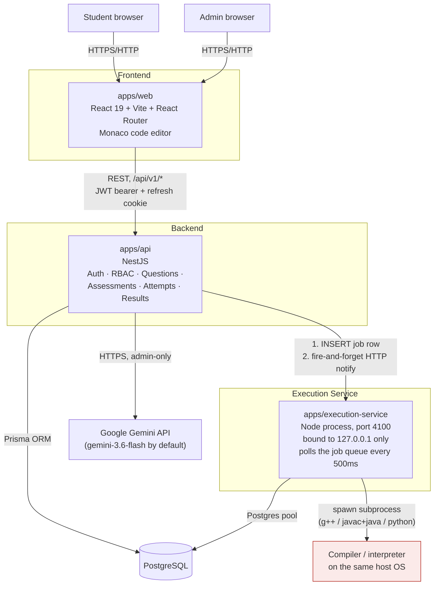

# Centurion Technical Assessment Platform — Product Guide

*This document was written by auditing the actual source code as it exists today (all four workspaces: `apps/api`, `apps/web`, `apps/execution-service`, `packages/shared`, plus `prisma/schema.prisma` and its migrations). Every claim below is backed by a real file. Where a feature is partially built, or built but not exposed, that is stated explicitly rather than rounded up. This is a living audit, not a marketing brochure — treat it as the source of truth for what you can actually promise a client.*

---

## 1. Product Overview

**What it is.** A web-based platform for running timed technical assessments (coding tests and multiple-choice quizzes) for Centurion University. An administrator builds a bank of coding questions and MCQs (by hand, or by asking an AI to draft them), assembles them into an assessment, assigns students, and publishes it. Students log in, take the assessment inside a real in-browser code editor with a live countdown timer, and get their score once the exam window closes.

**What problem it solves.** Replaces ad-hoc paper/Google-Forms-style testing for programming courses with something that behaves like a real online judge (compiles and runs actual C++/Java/Python code against test cases) combined with a standard MCQ exam tool — plus a workflow to let AI help generate question drafts without letting AI content go live unreviewed.

**Who uses it.** Two roles exist in the system today, enforced on every single API request (not just hidden in the UI):
- **ADMIN** — course staff / question setters. Full control over the question bank, assessments, participants, and AI generation/review.
- **STUDENT** — exam-takers. Can only see assessments they've been assigned, take them, and see their own results.

There is no third role (no "faculty" or "proctor" role exists in the database or code today, despite a comment in the schema reserving the idea for later).

---

## 2. Complete Architecture

The system is four independent Node.js/TypeScript workspaces in one npm monorepo, sharing one Postgres database:



**Component list — only what actually exists:**
- **`apps/web`** — React 19 + Vite + React Router 7. No Redux/state library; everything is `useState`/`useEffect` plus a small `AuthContext`. Monaco Editor for the code editor. As of Phase 14 it has a real design-system CSS layer and a shared `AppShell` (sidebar + topbar).
- **`apps/api`** — NestJS. This is the only service that talks to the frontend and the only one with business logic (auth, RBAC, questions, assessments, attempts, submissions, results, AI generation).
- **`apps/execution-service`** — a second, separate Node process. Its only job is compiling/running submitted code and writing results back to Postgres. It is never called directly by the browser — only by the API, and only over `127.0.0.1`.
- **`packages/shared`** — TypeScript types, Zod schemas, and enums shared by the API and the web app (single source of truth for things like allowed programming languages, difficulty levels, etc.).
- **PostgreSQL** — the only datastore. No Redis, no message broker, no Docker. The "job queue" between the API and the execution service is literally a database table (`execution_jobs`) plus a lightweight HTTP "wake up" ping — not a real broker.
- **Google Gemini** — called only from the API, only for the admin-triggered "Generate with AI" feature. Optional: the app boots and runs fine with no Gemini key configured; that one feature just returns a clear "not configured" error until a key is added.

---

## 3. How to Open the Project (Windows PowerShell)

These are the *actual* npm scripts from the real `package.json` files — nothing invented.

### 3.1 One-time setup

```powershell
cd "C:\Technical platform"
npm install
```

This installs dependencies for every workspace (`apps/api`, `apps/web`, `apps/execution-service`, `packages/shared`) in one pass, since it's an npm workspaces monorepo.

You also need, installed separately on the machine (not by `npm install`):
- **PostgreSQL** (a running server, any recent version) — the execution service and API both connect to it directly.
- **A C++ compiler** (`g++`, e.g. via MSYS2/MinGW-w64 on Windows) for the coding-question C++ runner to work.
- **A JDK** (`javac`/`java`) for the Java runner.
- **Python 3** for the Python runner. On Windows, note the app is written to call `python`, not `python3` (the repo's own comments flag that `python3` resolves to a broken Windows Store alias on some machines).

### 3.2 Environment variables

Two `.env` files, copied from the checked-in examples:

```powershell
Copy-Item "apps\api\.env.example" "apps\api\.env"
Copy-Item "apps\execution-service\.env.example" "apps\execution-service\.env"
```

Then edit both `.env` files. The variables that actually exist (from the real `.env.example` files):

**`apps/api/.env`**
| Variable | Purpose |
|---|---|
| `DATABASE_URL` | Postgres connection string |
| `JWT_ACCESS_SECRET` / `JWT_REFRESH_SECRET` | must be ≥16 characters, or the API refuses to start |
| `JWT_ACCESS_TTL` / `JWT_REFRESH_TTL` | default `15m` / `7d` |
| `FRONTEND_URL` | used for CORS — must match where the web app is served |
| `SEED_ADMIN_EMAIL` / `SEED_ADMIN_PASSWORD` / `SEED_STUDENT_EMAIL` / `SEED_STUDENT_PASSWORD` | optional — only used by the seed script |
| `EXECUTION_SERVICE_URL` | e.g. `http://127.0.0.1:4100` |
| `EXECUTION_SERVICE_SHARED_SECRET` | must match the same variable in the execution service's own `.env`; ≥16 characters |
| `RUN_RATE_LIMIT_MS` | minimum gap between Run/Submit calls per student per question (default 2000ms) |
| `GEMINI_API_KEY` | optional — leave blank to disable AI generation cleanly |
| `GEMINI_MODEL` | default `gemini-3.6-flash` |
| `AI_GENERATION_RATE_LIMIT_MS` | default 3000ms |

**`apps/execution-service/.env`**
| Variable | Purpose |
|---|---|
| `DATABASE_URL` | same Postgres database |
| `EXECUTION_SERVICE_SHARED_SECRET` | must match the API's value |
| `POLL_INTERVAL_MS` | default 500ms |
| `CPP_COMPILER_PATH` / `JAVA_HOME` (or `JAVAC_PATH`/`JAVA_PATH`) / `PYTHON_PATH` | point these at your real toolchain installs |
| `COMPILE_TIMEOUT_MS`, `RUNTIME_GRACE_MS`, `MAX_OUTPUT_BYTES`, `MAX_STDIN_BYTES`, `MAX_JOB_ATTEMPTS` | execution limits, all have sane defaults in `.env.example` |

### 3.3 Starting everything (three terminals, or three tabs)

```powershell
# Terminal 1 — API (NestJS, port 4000 by default)
cd "C:\Technical platform"
npm run dev:api

# Terminal 2 — execution service (port 4100, localhost only)
cd "C:\Technical platform"
npm run dev:execution-service

# Terminal 3 — frontend (Vite, port 5173 by default)
cd "C:\Technical platform"
npm run dev:web
```

These map exactly to the root `package.json` scripts:
```json
"dev:api": "npm run start:dev -w @technical-platform/api",
"dev:web": "npm run dev -w @technical-platform/web",
"dev:execution-service": "npm run dev -w @technical-platform/execution-service"
```

### 3.4 URLs to open

- **Web app**: `http://localhost:5173`
- **API health check**: `http://localhost:4000/api/v1/health`
- The execution service (`http://127.0.0.1:4100`) is internal-only — you never open it in a browser for real use.

### 3.5 Other useful root scripts

```powershell
npm run build       # builds shared → api → web → execution-service, in that order
npm run typecheck    # runs tsc --noEmit across all three apps
npm run lint         # runs oxlint across all three apps
```

---

## 4. Database Setup

- **Engine**: PostgreSQL, no Docker required or used anywhere in this codebase.
- **ORM**: Prisma 7, using the `@prisma/adapter-pg` driver adapter (not Prisma's older built-in engine binary).
- **Schema file**: `apps/api/prisma/schema.prisma`.

```powershell
cd "C:\Technical platform\apps\api"

# 1. Generate the Prisma client (writes to apps/api/generated/prisma)
npm run prisma:generate

# 2. Apply migrations to your local dev database
npm run prisma:migrate

# 3. (optional) Create the seed admin/student accounts and a sample question
npm run prisma:seed

# 4. (optional) Open a visual database browser
npm run prisma:studio
```

These map to the real `apps/api/package.json` scripts:
```json
"prisma:generate": "prisma generate",
"prisma:migrate": "prisma migrate dev",
"prisma:deploy": "prisma migrate deploy",
"prisma:studio": "prisma studio",
"prisma:seed": "prisma db seed"
```

**What the seed script actually does** (`apps/api/prisma/seed.ts`): it does *nothing* unless you set the `SEED_*` env vars listed above — no admin account is silently created. If `SEED_ADMIN_EMAIL`/`SEED_ADMIN_PASSWORD` are both set, it creates one admin user; likewise for a student. It also creates one sample approved coding question ("Two Sum", EASY, 10 marks, with 1 public + 1 hidden test case) — but only if an admin account already exists, and it skips silently if a question with that title already exists. It never overwrites an existing account.

**Migration history** (4 real migrations, in order): `init` → `add_code_drafts_and_starter_templates` → `add_test_result_status` → `phase13_login_lockout_and_safe_approval_default`. The most recent one added the two account-lockout columns to `users` (see §6 Security Audit) and hardened the default approval status on new questions.

---

## 5. Authentication and Roles

**How login works** (`POST /api/v1/auth/login`):
1. Password is checked with `bcrypt.compare` against a hash stored with cost factor 12.
2. On success, the API issues a short-lived **access token** (JWT, 15 minutes, returned in the JSON response body — the frontend keeps it in memory) and a **refresh token** (JWT, 7 days, set as an `httpOnly` cookie, never exposed to JavaScript). The refresh token is also stored, hashed, in the database so it can be individually revoked.
3. Refresh tokens **rotate** — every time the frontend silently refreshes its session, the old refresh token is marked revoked and a new one is issued. A stolen, already-used refresh token can't be replayed.
4. Logging out revokes the current refresh token and clears the cookie.

**Roles**: exactly two — `ADMIN` and `STUDENT`. Stored in a `roles` table, referenced from every `users` row.

**What Admins can do**: everything under `/questions`, `/assessments` (management side), `/ai/questions/*`, and `/users` — creating/editing/reviewing questions, building and publishing assessments, assigning participants, generating AI questions, viewing every student's results.

**What Students can do**: view assessments they've been assigned, start/resume their own attempt, run/submit their own code, answer MCQs, view their own result once the assessment window has closed. A student can never see another student's data, and never sees admin-only routes at all (they 403 immediately).

**How authorization is enforced** — this is the important part for a client demo: it is **not** a frontend-only check. Two guards run on *every single API request*, globally, before any business logic:
1. `JwtAuthGuard` — validates the access token and loads the real user from the database (rejecting inactive accounts). Routes explicitly marked `@Public()` (login, refresh, health check) skip this.
2. `RolesGuard` — reads the `@Roles(...)` decorator on the route. If a route has no role decorator at all, it is rejected — "deny by default," not "allow unless blocked." If the logged-in user's role isn't in the allowed list, the request is rejected with `403 Forbidden`.

So even if someone bypassed the UI entirely and called the API directly with a student's token, every admin-only action would be refused server-side.

---

## 6. Admin User Guide

### Dashboard
The admin landing page (`/admin`) is the **assessment list**, not a separate analytics dashboard. It shows real, live-queried numbers: total assessment count, how many are currently "active" (inside their scheduled window right now), how many are still drafts, and total participants assigned across all assessments — plus a filterable/searchable table of every assessment with its status, schedule window, marks, section count, and participant count. There is a "Create assessment" action right here.

### Question Bank
Reached via the sidebar → **Question Bank** (`/admin/questions`).

- **Create a coding question**: "Create question" opens a structured form — title, marks, full problem statement, input/output format, constraints, worked examples, difficulty, topics, tags, time/memory limits, supported languages, at least one public test case and one hidden test case, and at least one reference solution (in a supported language). The form enforces real limits: up to 20 examples, up to 50 test cases per side, time limit capped at 10 seconds, memory limit capped at 1024MB.
- **Create an MCQ**: "Create MCQ" — question text, optional code snippet, 2–8 options, single-choice or multiple-choice, optional negative marking value, optional admin-only explanation (never shown to students, ever).
- **Edit**: fully editable while the question isn't attached to any non-draft assessment. Once a question is used in a *published* assessment, the platform blocks further edits to protect exam fairness — you'll get a clear conflict error, not silent data loss.
- **Delete**: blocked the same way — a question in use by a non-draft assessment cannot be deleted.
- **Review/approval status** is shown as a colored badge on every question and question-detail page (see AI Review Queue below for the actual states).

### AI Question Generator
Reached via sidebar → **AI Generator** (`/admin/questions/ai-generate`).

- **How Gemini is used**: the admin picks a topic, difficulty, target language, and how many questions to generate (1–10 per request — that cap is hard-coded), plus optional "concepts to test" and free-text "additional instructions." The API builds a prompt from these and calls Google's Gemini API (model `gemini-3.6-flash` by default, configurable), asking for a strict JSON response matching the platform's own question schema.
- **Preview workflow**: nothing is saved yet. Every candidate question Gemini returns is independently re-validated against the same rules a manually-created question must satisfy (test case counts, reference solution presence, etc.). Anything that fails validation is shown separately with the exact reasons, not silently discarded. The admin sees full previews — problem statement, examples, both public and hidden test cases, and the reference solution — before deciding anything.
- **Saving generated questions**: the admin checks which drafts to keep and clicks "Save selected." Saved questions go through the *exact same creation path* as a manually-typed question — they are **not** trusted or fast-tracked in any way.
- If Gemini is unavailable, times out, or the server has no API key configured at all, the admin gets a clear error (the app never crashes) and can retry or regenerate.

### AI Review Queue
This is **not a separate database feature** — it's the Question Bank list, pre-filtered to `source = AI_GENERATED` and `approvalStatus = PENDING_REVIEW`, reached via a dedicated sidebar shortcut. Every AI-generated question always starts as `PENDING_REVIEW`, identically to a manual question.

The approval state machine (`PENDING_REVIEW → APPROVED / REJECTED / NEEDS_EDIT`, and back to `PENDING_REVIEW` via "send back to review") is driven entirely by one admin action: open the question, read everything (including the hidden test cases and reference solution — never hidden from admins), optionally leave a review note, and click Approve / Needs edit / Reject / Send back to review.

- **On Approve**: the server *re-checks* that the question genuinely has at least one public test case, one hidden test case, and one reference solution before allowing the flip — an admin can't approve an incomplete question by mistake.
- **On Reject**: no extra validation; it's simply recorded.
- **Every review action is logged** — reviewer, decision, notes, and timestamp are all kept in a `question_reviews` audit table, and the full history shows on the question's edit page.
- **Only `APPROVED` questions can ever be attached to an assessment.** This is checked again at publish time — if a question was approved, attached to an assessment, and *then* someone rejects it, the assessment cannot be published until that's fixed.

### Assessment Management
Reached via `/admin/assessments/:id` (open from the dashboard, or create new from there).

1. **Create assessment** — title, optional description, duration in minutes (1–600), start time, end time. Starts life as a `DRAFT`.
2. **Configure** — description/instructions can be edited any time; title/duration/schedule can only be changed while still `DRAFT`.
3. **Add sections** — each section is `CODING` or `MCQ` (fixed at creation). An assessment can mix section types (e.g. one coding section + one MCQ section).
4. **Add questions** — a searchable picker lets the admin attach any `APPROVED` question of the matching type (a `CODING` section only accepts coding questions, and vice versa). Marks can be overridden per-attachment without changing the question bank's own value.
5. **Assign participants** — either by pasting specific student IDs, or by department + batch (an exact match — this is a one-time snapshot, not a live group; adding a student to a batch afterward doesn't retroactively add them).
6. **Publish** — the button is disabled/blocked with a clear list of problems until *all* of the following are true: at least one section exists; every section has at least one question; every attached coding question has ≥1 public and ≥1 hidden test case; every attached MCQ passes its own option/correct-answer rules; every attached question is currently `APPROVED`; the end time is in the future and after the start time; and at least one participant is assigned. **Publishing with zero questions or zero participants is impossible** — the server refuses it, not just the UI.

Once published, structural edits (sections/questions/timing) lock — only participants and instructions text stay editable. Unpublishing is only allowed before the exam window has actually started; once students could have begun, you can't unpublish. Only `DRAFT` assessments can be deleted.

### Results
From an assessment's detail page → "View results":
- **Roster view**: every *assigned* participant, including no-shows (shown as `NOT_STARTED` with no score, never a fake zero), with status, score, percentage, and submission time — searchable and filterable by status.
- **Per-student detail**: full section-by-section, question-by-question breakdown — same shape the student sees for their own result, plus the student's name/email. Admins can open this **even while the student is still mid-attempt** (it will honestly say "attempt in progress, no score yet" rather than fabricate a partial score).
- **Rankings**: the platform *does* compute a rank for every finalized result (score first, earliest-submission-time as a tiebreaker) and stores it in the database — but **no screen or API endpoint currently displays it**. There is no leaderboard page today. If asked, say this honestly: ranking is computed internally but not yet surfaced to admins or students.

---

## 7. Student User Guide

### Student Dashboard
`/student` shows a personalized welcome and a table of every assessment the student has been assigned, with its status (Draft assessments are never assigned/visible; students only ever see Published/Active/Completed/Archived ones) and window. If they've already started, the row says "Resume"; otherwise "View" (which leads to the assessment's detail/start page).

### Starting an Assessment
Clicking "Start assessment" calls the server, which:
- Confirms the assessment is currently within its published time window (server clock, not the student's).
- Creates exactly one `Attempt` row per student per assessment — calling "start" again just resumes the same attempt (it's idempotent, so refreshing or reopening the tab is safe).
- Computes `endsAt` as **`min(now + duration, assessment's own end time)`** — so a student who starts late still can't run past the assessment's hard deadline, they simply get less time.
- A student gets exactly one attempt, ever, for a given assessment (enforced by a database uniqueness constraint) — there is no "retake" feature.

### Coding Assessment Experience
- **Problem statement** panel shows the full statement, input/output format, constraints, worked examples, and every **public** test case (never hidden ones).
- **Monaco editor** (the same editor engine VS Code uses) with real syntax highlighting for C++, Java, and Python — whichever the question supports.
- **Switching languages** keeps each language's code as a separate draft — you don't lose your C++ attempt by trying Python.
- **Running code** ("Run Code") executes the student's current code against **public test cases only**. It never counts toward the score and never marks the question "solved," but it is recorded in submission history.
- **Resetting code** reverts to the starter template for that language, after a confirmation dialog (this cannot be undone).
- **Public vs hidden test cases**: only public ones are ever shown to the student, with input/expected/actual output. Hidden test case results only ever show pass/fail and timing — never the input, the expected output, or the student's actual output. This is enforced at three independent layers in the code (the execution service's own query never even loads hidden cases for a "Run," the database row for a hidden result stores no output text, and the API's response type for students structurally has no field to put it in even if someone tried) — not just a UI filter.
- **Autosaving/drafts**: code is auto-saved to the server about 1.5 seconds after you stop typing, per question *and* per language, up to 100,000 characters. It also force-saves immediately if you close the tab. This draft is never executed or scored — it only becomes a real, graded record when you click "Submit Solution."
- **Question navigation**: a left-hand panel lists every question with a colored status dot (visited / attempted / solved) and lets you jump between them freely; nothing is locked to a linear order.

### MCQ Experience
- Single-choice questions render as radio buttons; multiple-choice as checkboxes — selecting an option **saves immediately** (no separate "save" step).
- The server computes correctness the moment you answer, but **the API response to the student never includes whether it was correct** — only that it saved successfully. There's no way to peek at the right answer mid-exam by inspecting network traffic.
- Multiple-choice grading is all-or-nothing: you must select exactly the full correct set to get credit; a partially-right selection gets whatever the negative-marking penalty is for a wrong answer (there's no partial credit).
- Clearing your selection (deselecting everything) resets the question back to "not attempted" rather than recording a guaranteed-wrong answer.

### Submitting
- **"Submit Solution"** (per coding question) judges the code against **all** test cases, public and hidden, and is recorded permanently in submission history. It's rate-limited together with "Run Code" (by default, no more than one Run+Submit combined per question every 2 seconds) to stop a scripted flood.
- **"Submit assessment"** (the whole exam) shows a confirmation dialog that explicitly states the submission is final and, if applicable, how many questions are still unanswered — you have to actively confirm.
- After submitting, the attempt is locked: no more code changes, no more MCQ answers, and the editor becomes read-only, though you can still browse everything you did.
- If the exam window simply expires while you're still working (whether the tab is open or closed), the server auto-submits your attempt for you — checked both immediately on your next action and by a background check that runs every 30 seconds, so you're never left in limbo.

### Results
A student sees their own result **only once the assessment's shared window has fully ended** (not just their own attempt — this is deliberate, so an early finisher can't leak hints to classmates still taking the exam). The result shows total score / max score / percentage, questions solved, time taken, and a full section-by-section, question-by-question breakdown with verdicts (Solved / Attempted / Not attempted) — but never a rank or class-wide comparison, since that's not exposed anywhere (see §6 Results).

---

## 8. Code Execution Explained

This is the section to be the most careful and honest about, because it directly affects what you can promise a client about security.

### How it actually works, end to end
1. Student clicks Run or Submit. The API validates the attempt is still active, checks the per-question rate limit, and inserts two rows: a `Submission` (status `PENDING`) and an `ExecutionJob` (status `QUEUED`).
2. The API sends a best-effort, fire-and-forget HTTP "wake up" ping to the execution service (1-second timeout; if it fails, nothing breaks — see step 3).
3. The execution service also polls the database every 500ms regardless, so a missed ping just costs up to half a second of extra latency, never a lost job.
4. The execution service claims one job at a time and:
   - **C++**: compiles with `g++ -O2 -std=c++17`, then runs the binary.
   - **Java**: compiles with `javac`, then runs with `java -Xmx<memoryLimitMb>m -XX:+UseSerialGC`.
   - **Python**: no compile step; runs directly with `python -B -I` (isolated mode — this is a startup-hygiene flag, explained below, not a security control).
   - Each test case's input is piped to the program's stdin; output is compared to the expected output (whitespace-normalized) with a hard cap on how much output it will even read.
5. Results are written back to Postgres per test case, and the student's browser polls `GET /submissions/:id` until the status leaves "pending/running."

### Timeouts and error handling
- **Compile timeout**: 10 seconds by default.
- **Run timeout**: the question's own time limit plus a small fixed grace period (1 second, to absorb JVM/interpreter startup).
- On timeout, the *entire process tree* is killed (not just the top-level process) — on Windows via `taskkill /T /F`, on Linux by killing the whole process group. This specifically fixes a real bug that existed before Phase 13, where a forked child process could outlive the timeout on Linux.
- Verdicts returned to the student are one of: Accepted, Wrong Answer, Compilation Error, Runtime Error, Time Limit Exceeded, Memory Limit Exceeded, or a generic "please try again" for infrastructure-level failures. Error text shown for compile/runtime errors is the real compiler/interpreter message, but it's length-capped and has absolute file paths stripped out first.

### Public vs hidden test cases
Enforced three separate times, independently: the execution service's own database query for a "Run" never even fetches hidden test cases; a hidden test case's actual output is stored as a database `NULL`, never populated; and the API's data shape for a student response has no field to carry it even if someone tried to put it there. This is genuinely solid.

### ⚠️ Security risks — the honest answer

**Is arbitrary student code sufficiently isolated for real production deployment? No — not as it stands today.**

- **There is no sandbox.** No Docker, no container, no chroot, no seccomp profile, no dedicated restricted OS user is created or enforced anywhere in this codebase. Submitted code runs as a normal subprocess of whatever OS account is running the execution service.
- **Filesystem access is unrestricted.** A malicious submission can simply read any file that OS account can read — for example a Python submission doing `print(open('/path/to/.env').read())` would return the contents as ordinary output. The only mitigation is that the process's *environment variables* are stripped before it runs (so it can't read `DATABASE_URL`/API keys out of `process.env`), but that doesn't stop it from opening files directly.
- **Network access is unrestricted.** A submission can make arbitrary outbound HTTP/socket connections. Nothing in the code blocks this.
- **Memory limits are inconsistent.** Java gets a real, hard limit via the JVM's own `-Xmx` flag — that one works everywhere. C++ and Python get a kernel-level memory cap (`ulimit -v`) **only on Linux** — on Windows, the exact platform this is currently being developed and demoed on, that limit is silently skipped entirely. Actual memory *usage* is never even measured or reported for any language, on any platform (it's stored as `null`).
- **Concurrency is single-threaded by design** — the execution service processes exactly one job at a time, so a burst of submissions during a live exam queues up safely rather than spawning dozens of unbounded processes; the tradeoff is that a busy exam period will feel slower, not that it's unsafe.
- **What actually protects this today**: (1) the child process's environment is stripped of all secrets before it runs, (2) each run gets a fresh, deleted-afterward temp directory, (3) timeouts and tree-kill work correctly, (4) error text is sanitized. That's a real, if partial, set of protections — but it is **process isolation with resource limits, not a security sandbox.**
- The project's own internal design docs (`docs/coding-engine.md`, `docs/security.md`) are explicit that production safety for this component depends on an *operational* step — running the execution service under a dedicated, unprivileged, home-less OS account with no read access to secrets — that this codebase does not itself provision, configure, or verify. That's a deployment responsibility someone still has to actually do.

**Bottom line to tell a client honestly**: this is a fully functional online judge for a supervised demo or a trusted pilot group. It is not yet hardened the way a public, adversarial, real-graded-exam deployment would need to be.

---

## 9. AI System Explained

- **Provider**: Google's official `@google/genai` SDK, talking to the Gemini API. Model name comes from `GEMINI_MODEL` (default `gemini-3.6-flash`), configurable without a code change.
- **Response format**: Gemini is called in structured/JSON mode with an explicit schema describing exactly what fields a generated question must have — this is the platform's own first line of defense against garbage output, not just "hope the model returns valid JSON."
- **Timeout**: 60 seconds per call (measured against real Gemini latency during development).
- **Retries**: up to 3 attempts total, exponential backoff starting at 500ms — but only for errors classified as retryable (rate limits, 5xx server errors, timeouts). An invalid API key or a bad request is *not* retried, since retrying won't fix that.
- **Rate limiting**: two independent mechanisms — an identical-request dedupe window (60 seconds — clicking Generate twice with the same inputs doesn't burn a second Gemini call) and a per-admin cooldown (3 seconds by default) so a double-click or a scripting mistake can't spam the free-tier quota. The number of questions per request is hard-capped at 10.
- **Validation**: every single candidate question Gemini returns is independently re-validated against the same Zod schema a manual question must pass — minimum test cases, at least one reference solution in a supported language, etc. Anything that fails is shown to the admin with the specific reasons, never silently dropped, and it never becomes a database row.
- **Saving**: identical code path to a manually typed question. AI-generated questions always start as `source = AI_GENERATED`, `approvalStatus = PENDING_REVIEW` — there is no "auto-approve AI content" shortcut anywhere.
- **Audit trail**: every generation attempt (successful or not) is recorded in an `ai_generation_requests` table — who requested it, the exact prompt sent, the difficulty/topic/count asked for, the raw response (capped at 20,000 characters so it can't bloat the database), and its outcome. Every saved question keeps a link back to the request that produced it.
- **If Gemini is unavailable**: the app **does not crash**. If no API key is configured at all, the platform boots normally and the AI generation endpoint simply returns a clear "AI provider not configured" error the moment someone tries to use it. If Gemini itself is down or times out, the request retries automatically and then, if still failing, surfaces a clean error to the admin — never a raw stack trace.
- **One honest gap**: the admin's free-text "additional instructions" field is inserted directly into the prompt with a length cap (1,000 characters) but no other filtering. There's no explicit instruction telling the model to ignore attempts to override its own system behavior via that field. The practical risk is low (only trusted admins can reach this endpoint, and everything the model returns is re-validated and requires human approval before it's ever live) but it's worth knowing this exists if the topic of "AI safety" comes up.

---

## 10. Security Audit Summary (Phase 13)

| Area | Status | Detail |
|---|---|---|
| Password hashing | ✅ Implemented | bcrypt, cost factor 12 |
| Password complexity rules | ❌ Missing | Only length is checked (8–200 chars) — no uppercase/digit/symbol requirement |
| JWT access + refresh tokens | ✅ Implemented | 15-minute access token, 7-day rotating/revocable refresh token, refresh stored hashed |
| Account lockout | ✅ Implemented | 5 failed attempts on one account → 15-minute lock, persisted in the database |
| Per-IP login throttling | ⚠️ Partially implemented | 30 failures per IP per 5-minute window — but stored only in server memory, so it resets on restart and doesn't share state across multiple server instances |
| Role-based authorization | ✅ Implemented | Global, deny-by-default guard on every route; a route with no role decorator is rejected, not silently open |
| Input validation | ✅ Implemented | Every request body/query is validated with Zod before it reaches business logic |
| Rate limiting elsewhere | ⚠️ Partially implemented | Only three things are throttled: login, code run/submit, and AI generation. Every other endpoint (user management, assessment CRUD, results, etc.) has no rate limiting at all beyond the auth check |
| Error responses | ✅ Implemented | A global exception filter logs full stack traces server-side but only ever sends a generic message to the client — no stack traces or internals ever leak |
| Security headers (Helmet, CSP, HSTS, etc.) | ❌ Missing | Not present anywhere in the codebase |
| HTTPS enforcement | ❌ Missing | No redirect-to-HTTPS, no HSTS header. The app assumes TLS termination happens somewhere in front of it (a reverse proxy) in production, but does nothing itself to enforce that |
| CORS | ✅ Implemented (narrow) | Locked to exactly one origin (from `FRONTEND_URL`), credentials allowed — not a wildcard |
| Secrets management | ✅ Implemented | All required secrets (DB URL, JWT secrets, shared secret) must be ≥16 characters and are validated at startup — the app refuses to boot with a missing/weak secret rather than failing later in a confusing way |
| SQL injection protection | ✅ Implemented | Every query goes through Prisma's parameterized query builder; no raw string-built SQL exists in the codebase |
| Hidden exam data protection | ✅ Implemented | Triple-enforced (see §8) — hidden test cases and reference solutions are never reachable by a student-role request |
| Code execution isolation | ❌ Missing (see §8) | No sandbox — see the honest breakdown above |

---

## 11. Deployment Readiness Audit

### Is This Product Ready for Deployment?

### 🟢 Demo Ready — **Yes.**
Every core flow (login, question authoring, AI generation + review, assessment build/publish, student exam with a live timer/Monaco editor/run-submit, results) works end-to-end against a real database and a real execution service, and was exercised live during this audit. For a controlled, presenter-driven demonstration on a known machine/network, this product is ready today.

### 🟡 Staging Ready — **Yes, with conditions.**
It's reasonable to run this for a small, trusted pilot (a real class of students who aren't being asked to attack the system) *if*:
- It's deployed on **Linux**, not Windows — several security/resource controls (memory limits for C++/Python, process-group kill) only work on POSIX systems; on Windows they're silently no-ops.
- Real, unique, long secrets are generated for every `.env` value (not the placeholder values in `.env.example`).
- A reverse proxy in front of it terminates HTTPS (the app itself does nothing for TLS).
- The execution service runs under its own restricted OS account with no access to `.env` files or other services' data — this is a deployment step nobody has automated yet.
- Someone is watching it manually, since there's no monitoring/alerting.

### 🔴 Production Ready (real students, unsupervised, at scale) — **No.**
The gaps that matter most:
- **Code execution has no real sandbox** (§8). This is the single biggest blocker for anything graded-for-credit at real scale with untrusted/adversarial users.
- **No HTTPS/security headers built in** — entirely dependent on infrastructure someone else has to configure correctly.
- **No logging/error-monitoring/alerting infrastructure** (e.g. Sentry, structured logs shipped somewhere) — failures are only visible in server console output.
- **No documented backup/disaster-recovery process** for the database.
- **Login-throttling doesn't survive a restart or scale past one server instance** (it's an in-memory map).
- **The execution service processes one submission at a time** — fine for a pilot, a real risk for "the whole class hits Submit in the last 2 minutes" at scale, though the design does support adding more worker instances later without rework.
- **Password policy is minimal** (length only).

**Final verdict**: This is a genuinely well-built MVP with real security thinking already in it (JWT rotation, account lockout, deny-by-default RBAC, sanitized errors, hidden-data triple-enforcement) — it is **not** a toy. But it is not honest to call it "production ready" for real, unsupervised, high-stakes student use until the code-execution sandbox and basic operational hardening (HTTPS, monitoring, backups) are addressed.

---

## 12. Client Demo Script (10–15 minutes)

### 1. Product introduction
**Click**: nothing yet — just have the login page open.
**Say**: "This is Centurion University's own technical assessment platform — built in-house, not a third-party tool. It runs real coding exams with a real code editor and judge, plus multiple-choice exams, and it has an AI assistant to help draft questions faster, with a human approval step before anything goes live."
**Notice**: a clean, branded login screen, not a generic template.
**Technical point**: everything you'll see is enforced twice — once in this interface, and independently again on the server, so nothing here is "just a UI trick."

### 2. Admin login
**Click**: enter the admin email/password, Sign in.
**Say**: "I'm logging in as an administrator."
**Notice**: instant redirect straight to the admin dashboard.
**Technical point**: passwords are hashed with bcrypt; five wrong attempts locks the account for 15 minutes automatically.

### 3. Admin Dashboard
**Click**: nothing — just look at the landing page.
**Say**: "This is the live assessment list — total assessments, how many are active right now, drafts, and participants, all read straight from the database."
**Notice**: real numbers, not placeholders.
**Technical point**: nothing on this page is hard-coded — every stat is a live query.

### 4. Question Bank
**Click**: sidebar → Question Bank.
**Say**: "This is where every coding question and MCQ lives, with search and filters by type, difficulty, topic, approval status, and source."
**Notice**: the approval-status badges (color-coded), and the "AI generated" tag on some questions.
**Technical point**: a question can only ever be attached to an exam once it's approved — that's enforced server-side, not just hidden in the menu.

### 5. Create or show a coding question
**Click**: open an existing approved coding question (safer than creating a new one live, to save time).
**Say**: "Here's the full authoring form — problem statement, examples, constraints, public test cases students see, and hidden test cases they never see, plus a reference solution we use to validate the question itself."
**Notice**: the clear separation between "public" and "hidden" sections.
**Technical point**: a question needs at least one hidden test case and one reference solution before it can even be approved.

### 6. Show MCQ system
**Click**: open an approved MCQ.
**Say**: "The same idea for multiple-choice — single or multi-answer, with optional negative marking, and an explanation field that only admins ever see."
**Notice**: the explanation field is clearly marked admin-only.
**Technical point**: correctness for MCQs is never sent to the student's browser in any API response, even mid-exam.

### 7. Demonstrate AI Question Generator
**Click**: sidebar → AI Generator; fill topic/difficulty/language/count; click Generate.
**Say**: "This calls Google's Gemini model to draft questions to spec — but nothing is saved yet, this is a preview only."
**Notice**: the generated cards look identical in structure to a manually-written question — full problem statement, test cases, reference solution.
**Technical point**: every candidate is independently re-validated against the platform's own rules before you're even allowed to save it — Gemini doesn't get a shortcut.

### 8. Demonstrate AI Review Queue
**Click**: save a couple of the generated drafts, then go to AI Review Queue.
**Say**: "Every AI-generated question lands here as pending review — nobody, including AI, publishes directly to students."
**Notice**: the filtered view shows exactly the AI-generated, unreviewed items.
**Technical point**: approving re-checks the same completeness rules one more time, server-side, so a reviewer can't accidentally approve something incomplete.

### 9. Create/show an assessment
**Click**: Assessments → open or create one.
**Say**: "This is where a coding exam or quiz actually gets assembled — title, duration, and a time window."

### 10. Add questions
**Click**: add a section, attach an approved question via the picker.
**Say**: "Only approved questions show up here — nothing pending review can sneak into an exam."

### 11. Assign participants
**Click**: assign by student ID or by department/batch.
**Say**: "We can assign specific students, or an entire batch at once."
**Technical point**: batch assignment is a one-time snapshot at the moment you assign — it's not a live, auto-updating group.

### 12. Publish
**Click**: Publish.
**Say**: "The system won't let this go live until every requirement is met — questions, test cases, approvals, a valid time window, and at least one participant."
**Notice**: if anything is missing, publishing is blocked with a specific, readable reason — not a generic error.

### 13. Logout
**Click**: Sign out.
**Say**: "Now let's see the student side."

### 14. Student login
**Click**: log in with the student account.
**Notice**: a completely different, simpler layout — no sidebar clutter, since students only ever need one thing: their assessments.

### 15. Student Dashboard
**Say**: "Every assessment assigned to this student, with its status and window."

### 16. Start assessment
**Click**: Start assessment.
**Say**: "The timer starts now, and it's tracked on the server — not just in this browser tab."
**Technical point**: closing this tab right now would not stop the clock or let the student regain lost time.

### 17. Demonstrate coding environment
**Click**: open a coding question.
**Say**: "Full problem statement on the left, editor on the right — this is the same editor engine that powers VS Code."

### 18. Show Monaco editor
**Click**: type a bit of code, switch languages.
**Say**: "Each language keeps its own separate draft, auto-saved as you type."

### 19. Run code
**Click**: Run Code.
**Say**: "This checks against the public test cases only — it's a sanity check, not the graded result."
**Notice**: the pass/fail panel, with timing per test case.

### 20. Show question navigation
**Click**: the question list on the left.
**Say**: "Students can jump between questions freely — nothing is locked into a fixed order — and this panel shows what's solved, attempted, or untouched."

### 21. Demonstrate submission confirmation
**Click**: Submit assessment.
**Say**: "Submitting the whole exam requires an explicit confirmation, and it tells you exactly how many questions are still unanswered before you commit."
**Notice**: the dialog, not a browser `confirm()` popup — a real, styled confirmation.

### 22. Show results
**Click**: confirm submission, then View result (after adjusting the demo assessment's window to have ended, or using a pre-completed one).
**Say**: "Once the exam window closes, the student sees their score, percentage, and a full breakdown by question."
**Technical point**: results are deliberately withheld from a student until the *whole class's* window closes, not just their own attempt, so an early finisher can't leak the answers to anyone still testing.

### 23. Closing product summary
**Say**: "So in one platform: question authoring, AI-assisted drafting with human review, real exam scheduling and enforcement, a genuine multi-language code judge, and results — all built on the same in-house codebase, with server-side enforcement backing every rule you just saw on screen."

---

## 13. Demo Data Checklist

```
ADMIN ACCOUNT
[ ] At least one working admin login
    → Exists today if SEED_ADMIN_EMAIL/SEED_ADMIN_PASSWORD were set before seeding
    → To create manually: run the seed script with those vars set, or ask an
      existing admin to create one (there is no self-registration screen)

STUDENT ACCOUNT
[ ] At least one working student login, assigned to your demo assessment
    → Same seeding mechanism as above (SEED_STUDENT_EMAIL/SEED_STUDENT_PASSWORD)

APPROVED CODING QUESTION
[ ] At least one, with a clear problem statement and a correct reference solution
    → Create via Question Bank → "Create question", then approve it via its
      own Review panel (or use the seeded "Two Sum" sample question)

APPROVED MCQ QUESTION
[ ] At least one, single-choice or multi-choice
    → Question Bank → "Create MCQ", then approve it

AI-GENERATED QUESTION (for the AI demo steps)
[ ] At least one saved, PENDING_REVIEW, visible in the AI Review Queue
    → Run the AI Generator once before the demo and save 1-2 drafts, OR do
      it live if your Gemini quota/latency is reliable that day

PUBLISHED ASSESSMENT (coding + MCQ mix recommended)
[ ] One published assessment with a window covering your demo time
    → Create it, attach approved questions, assign your demo student,
      then Publish

ASSIGNED STUDENT ON THAT ASSESSMENT
[ ] Confirm the demo student account is in the Participants list

COMPLETED RESULT (for the results demo step)
[ ] A second, already-finished assessment/attempt so you can show a real
    result without waiting for a live one to expire
    → Easiest approach: create a short assessment (e.g. 2-minute duration,
      window already in the past relative to your demo time), have the demo
      student attempt and submit it well before presenting
```

**If you're short on time before a demo**, the fastest path is: seed the two accounts → log in as admin → create one coding question and approve it → create one short assessment, attach that question, assign the student, publish it with a window that's already open → log in as the student and complete it once, ahead of time, so you have both a "fresh" assessment to demo live and a "completed" one to show results from.

---

## 14. Final Product Status

| Feature | Status | Client Demo Ready | Production Ready |
|---|---|---|---|
| Login / JWT auth / role-based access | ✅ Fully implemented | Yes | Yes |
| Account lockout (brute-force protection) | ✅ Fully implemented | Yes | Yes |
| Per-IP login throttle | ⚠️ In-memory only | Yes | No — needs a shared store |
| Question bank (coding) | ✅ Fully implemented | Yes | Yes |
| Question bank (MCQ) | ✅ Fully implemented | Yes | Yes |
| Approval workflow | ✅ Fully implemented | Yes | Yes |
| AI question generation | ✅ Fully implemented | Yes (needs a valid Gemini key + quota) | Yes |
| AI review queue | ✅ Fully implemented (as a filtered view) | Yes | Yes |
| Assessment creation/publish rules | ✅ Fully implemented | Yes | Yes |
| Participant assignment | ✅ Fully implemented | Yes | Yes |
| Server-authoritative timer | ✅ Fully implemented | Yes | Yes |
| Monaco code editor (C++/Java/Python) | ✅ Fully implemented | Yes | Yes |
| Code execution / judging | ✅ Functionally complete | Yes | **No — no sandbox, see §8** |
| Draft autosave | ✅ Fully implemented | Yes | Yes |
| MCQ answering, no answer-leak | ✅ Fully implemented | Yes | Yes |
| Submission confirmation dialogs | ✅ Fully implemented (Phase 14) | Yes | Yes |
| Results (score/breakdown) | ✅ Fully implemented | Yes | Yes |
| Ranking / leaderboard | ⚠️ Computed, never exposed | No — don't demo this | No — decide first |
| Rate limiting | ⚠️ Only 3 endpoints covered | Yes | Needs broadening |
| HTTPS / security headers | ❌ Not implemented | N/A (use a proxy) | No |
| Monitoring / error tracking | ❌ Not implemented | N/A | No |
| Backups | ❌ Not documented/implemented | N/A | No |
| Frontend design system (Phase 14) | ✅ Fully implemented | Yes | Yes |

### 1. What is impressive about the product
- A real, working multi-language online judge (not a mock) with a genuinely enforced timer and a triple-layered defense against leaking hidden test data.
- An AI generation feature with an actual human-approval gate and independent server-side re-validation — not "trust whatever the model says."
- Thoughtful, already-implemented security fundamentals (bcrypt, rotating JWTs, account lockout, deny-by-default authorization, sanitized error responses) that a lot of student projects skip entirely.
- A coherent, purpose-built frontend design system (Phase 14) rather than a default template look.

### 2. What you should confidently demonstrate
Everything in the demo script above — login, question authoring, AI generation + review, assessment publish rules, the full student exam experience (timer, editor, run/submit, confirmations), and results.

### 3. What you should avoid claiming
- Do **not** call the code execution "sandboxed" or "secure against malicious code" — say "isolated with resource limits," honestly.
- Do **not** demo or mention "rankings/leaderboard" as a working feature — it's computed but not shown anywhere.
- Do **not** claim built-in HTTPS, monitoring, or automated backups — those are infrastructure choices for whoever hosts it.
- Do **not** claim SSO/university-system integration exists — the data model has a placeholder field for it, but no actual integration is built.
- Do **not** claim plagiarism detection or anti-cheating measures beyond the timer — none exist.

### 4. What needs improvement before production
1. Real code-execution sandboxing (or at minimum, a verified dedicated-restricted-OS-account deployment on Linux).
2. HTTPS + security headers (a reverse proxy with Helmet-equivalent headers).
3. Centralized logging/error monitoring.
4. A documented, tested database backup process.
5. Moving the login IP-throttle to a shared store (Redis/DB) if you ever run more than one API instance.

### 5. Top 5 next steps after Phase 14
1. **Harden or replace the execution sandbox** before any real, graded, unsupervised deployment.
2. **Decide the fate of ranking/leaderboard** — finish exposing it, or remove the half-built plumbing so it doesn't confuse future maintainers.
3. **Add basic observability** — structured logs, error tracking, uptime checks.
4. **Formalize deployment**: HTTPS termination, restricted execution-service OS account, secret rotation, backup schedule.
5. **Load-test the execution queue** under realistic "whole class submits in the last two minutes" conditions, since it currently processes one job at a time by design.
