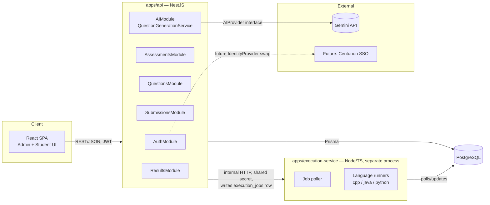

# Architecture Overview — Centurion Technical Assessment Platform

## 0. Environment inspection (2026-09-05)

The project directory was empty. Host machine (Windows 11) has:

| Tool | Found | Notes |
|---|---|---|
| Node.js | v22.22.3 | via nvm4w |
| npm | 10.9.8 | workspaces supported natively |
| pnpm | present | not required, npm workspaces used instead |
| Java (JDK) | 21.0.2 | `java`/`javac` available — needed for Java submissions |
| Python | 3.12.2 | at `C:\Users\hp\AppData\Local\Programs\Python\Python312`; the `python3` shim is a Windows Store alias stub — the execution service must invoke `python` (or the resolved absolute path), not `python3` |
| C++ compiler (g++/gcc) | **not found** | must be installed separately (MinGW-w64/MSYS2, or run the execution service under WSL) before C++ submissions can compile. Tracked as a setup risk — see `implementation-plan.md`. |
| PostgreSQL | **not found** | no local server, no `psql`, no Windows service. Must be installed separately (see `database-schema.md` §Setup). |
| Docker | present but **excluded by requirements** | not used anywhere in this design |
| Git | present | |

This shaped two decisions: (1) the execution service must resolve language toolchains via configurable paths/env vars rather than assuming `PATH` entries, and (2) nothing in the architecture assumes Docker or a pre-existing Postgres instance — both are explicit setup steps in Phase 1.

## 1. Product framing

This is an **examination system**, not a learning platform. Every architectural choice below optimizes for: exam integrity (server-authoritative timing and scoring), untrusted-code safety (isolated execution), and future integration into Centurion University's existing platform (API-first, identity-abstracted, provider-abstracted AI/execution).

## 2. Technology stack

| Layer | Choice | Why |
|---|---|---|
| Language | TypeScript everywhere (API, execution service, frontend, shared package) | One language across the stack lowers maintenance cost for a small team; strong typing is explicitly requested; lets us share Zod schemas between the API validation layer, the frontend, and the AI structured-output validator instead of writing validation logic three times. |
| Backend framework | **NestJS** on Node.js 22 | The product spec itself is shaped like a set of swappable modules (`AIProvider`, execution sandbox, identity provider) behind interfaces — that is exactly what Nest's module/provider/DI system is for. Nest gives us Guards for RBAC (clean place to enforce ADMIN vs STUDENT vs future FACULTY), Interceptors for consistent response/error shaping, and a module boundary per domain (`assessments`, `questions`, `submissions`, `ai`, `auth`) that maps 1:1 to the domains in the spec. This buys structure that a bare Express/Fastify app would require us to hand-roll. |
| Validation | **Zod**, shared via `packages/shared` | One schema definition reused for (a) NestJS request DTO validation, (b) Gemini structured-output validation (§9 of the spec explicitly requires strict schema validation of AI output), and (c) frontend form validation. Avoids running two validation systems (e.g. class-validator *and* Zod). |
| Database | **PostgreSQL** | Required by spec. |
| ORM | **Prisma** | Type-safe query results generated from a single `schema.prisma`, first-class migration tooling (`prisma migrate`), and it maps cleanly onto a normalized relational schema (no fighting an ORM into JSON-blob shortcuts, which the spec explicitly warns against). |
| Auth | Passport.js (local strategy + JWT strategy) behind a Nest `AuthModule`, bcrypt for password hashing | JWT access/refresh tokens give us a stateless, integration-friendly session model. All identity resolution goes through an `IdentityProvider` interface (see `integration.md`) so the initial local-credentials implementation can be swapped for Centurion SSO later without touching business logic. |
| Frontend | **React 18 + TypeScript + Vite**, TanStack Query (server state), React Router, Tailwind CSS | Vite gives fast dev iteration; TanStack Query removes hand-rolled loading/error/cache state for API calls; Tailwind keeps a "serious university platform" look consistent without a heavy design-system dependency. |
| Code editor | **Monaco Editor** (the engine behind VS Code) | Industry-standard choice for competitive-programming-style editors (syntax highlighting, line numbers, multi-language support) without building an editor from scratch. |
| Code execution | Standalone **execution-service** (separate Node/TS process), local-process sandboxing (no Docker) | See `coding-engine.md`. Kept as its own deployable unit from day one so it can be replaced by a real sandbox/remote judge later without touching the API. |
| AI | Google **Gemini API** via `@google/genai`, wrapped behind an `AIProvider` interface | See `ai-integration.md`. |
| Monorepo tooling | **npm workspaces** | Already available with the installed npm 10 — no extra dependency (Turborepo/Nx/pnpm) is justified for a 3-app monorepo at this stage. |
| Testing | **Vitest** (unit) + **Supertest** (API integration) | Vitest is TS-native and fast; reusing it across `apps/api`, `apps/execution-service`, and `apps/web` avoids a second test runner. |
| API docs | OpenAPI generated from Zod schemas (`@asteasolutions/zod-to-openapi`) | Single source of truth (the Zod schema) drives both runtime validation and published API docs — no manual drift. |

### Explicitly rejected options (and why)

- **Docker** — disallowed by requirements. Execution isolation is achieved with OS-level process controls instead (see `coding-engine.md`).
- **TypeORM** — Prisma has better type inference and a simpler migration model for this team size; no reason to take on TypeORM's more verbose decorator/repository pattern.
- **NextJS (full-stack framework)** — the spec requires a clean separation between a REST API (for future integration into another platform) and a frontend. A framework that blends server/client rendering does not fit "API-first"; a plain SPA talking to the Nest API keeps that boundary explicit.
- **Redis / a message queue (BullMQ, RabbitMQ)** — not justified yet. The execution service's job queue is modeled as rows in Postgres (`execution_jobs`) with an in-process worker pool. This avoids a second infrastructure dependency for an MVP's expected load. If concurrent execution volume grows, swapping the job table for a real queue is a contained change (see `coding-engine.md` §Scaling note).
- **A full permissions/ACL table** — the spec asks only for ADMIN/STUDENT now with FACULTY later. A `roles` table with a `code` column checked by Nest Guards is enough to add FACULTY (new row + guard config) without a migration. A fine-grained permission matrix is deferred until a real requirement for per-faculty permission variance appears.

## 3. High-level component diagram



The execution service never talks to Postgres for anything except its own `execution_jobs`/`submission_test_results` rows, and it never receives database credentials for any other table — enforced via a dedicated Postgres role (see `security.md`).

## 4. Folder structure

```
technical-platform/
├── docs/                              # this documentation set
├── package.json                       # npm workspaces root
├── tsconfig.base.json
├── .env.example
├── .gitignore
├── packages/
│   └── shared/                        # @technical-platform/shared
│       ├── src/
│       │   ├── schemas/               # Zod schemas: coding question, MCQ, AI output, DTOs
│       │   ├── enums/                 # AssessmentStatus, Difficulty, SubmissionStatus, etc.
│       │   ├── types/
│       │   └── constants/
│       └── package.json
├── apps/
│   ├── api/                           # @technical-platform/api (NestJS)
│   │   ├── src/
│   │   │   ├── modules/
│   │   │   │   ├── auth/
│   │   │   │   ├── users/
│   │   │   │   ├── assessments/
│   │   │   │   ├── questions/         # question bank: coding + mcq
│   │   │   │   ├── submissions/
│   │   │   │   ├── ai/                # QuestionGenerationService, AIProvider, GeminiProvider
│   │   │   │   ├── execution-client/  # thin client calling execution-service
│   │   │   │   └── results/
│   │   │   ├── common/                # guards, interceptors, filters, decorators
│   │   │   └── main.ts
│   │   ├── prisma/
│   │   │   ├── schema.prisma
│   │   │   └── migrations/
│   │   └── package.json
│   ├── execution-service/             # @technical-platform/execution-service
│   │   ├── src/
│   │   │   ├── runners/               # cpp.runner.ts, java.runner.ts, python.runner.ts
│   │   │   ├── sandbox/               # ProcessSandbox (replaceable implementation)
│   │   │   ├── worker/                # job poller/executor
│   │   │   └── server.ts              # internal-only HTTP API
│   │   └── package.json
│   └── web/                           # @technical-platform/web (React + Vite)
│       ├── src/
│       │   ├── admin/                 # admin dashboard routes
│       │   ├── student/               # exam-taking UI
│       │   ├── shared/                # editor, auth, api-client
│       │   └── main.tsx
│       └── package.json
```

## 5. Cross-cutting design principles

1. **Server-authoritative everything.** Exam timing, scoring, and test-case verdicts are always computed server-side. The frontend renders state; it never decides it.
2. **Interfaces before providers.** `AIProvider`, `Sandbox`, and `IdentityProvider` are TypeScript interfaces in `packages/shared` or module-local `interfaces/` folders. Concrete implementations (`GeminiProvider`, `ProcessSandbox`, `LocalIdentityProvider`) are injected via Nest's DI container, so a replacement is a new class + one binding change, not a rewrite.
3. **Hidden data never leaves the boundary that owns it.** Hidden test case inputs/outputs and reference solutions are excluded at the DTO/serialization layer, not filtered client-side.
4. **Question bank is reuse-first.** Questions are never owned by a single assessment; `assessment_questions` is always a join, never a copy.
5. **No feature is built until its phase.** Debugging/SQL modules, partial scoring, faculty role, and SSO are represented only as extension points (an enum value, a nullable column, an interface) — not as half-built features.

See `implementation-plan.md` for phasing, `database-schema.md` for the schema, `api-specification.md` for endpoints, and `security.md` for the threat model.
