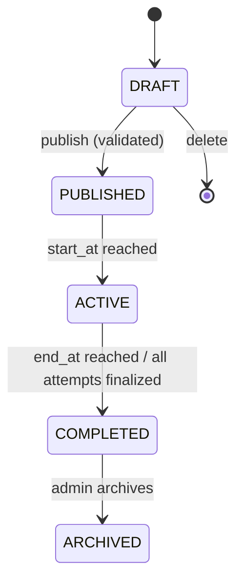

# Assessment System

## 1. Lifecycle

- **DRAFT**: fully editable (title, sections, questions, timing, participants).
- **PUBLISHED**: visible to assigned students as "upcoming"; structural edits (sections/questions/timing) are locked to prevent unfairness if some students have already seen the assessment window; only participant list and instructions text remain editable.
- **ACTIVE**: `now()` is within `[start_at, end_at]`; students may `start`/continue attempts.
- **COMPLETED**: `now() > end_at`; no new attempts can start; in-progress attempts are auto-submitted by the expiry sweep (see §3).
- **ARCHIVED**: read-only historical record; excluded from default admin list views.

Status is **derived**, not just stored: a scheduled check (see §3) transitions PUBLISHED→ACTIVE→COMPLETED based on `start_at`/`end_at` rather than relying on an admin to click a button, since exam windows must be time-authoritative.

## 2. Structure

`Assessment → Sections → Questions`, `Assessment → Participants`, `Assessment → Attempts → Results` (see `database-schema.md` for the exact tables). A section has a `section_type` (`CODING` or `MCQ`) — the MVP allows both types in one assessment (e.g. an MCQ section followed by a coding section), which the spec's example structure (Coding, Technical MCQ as sibling top-level modules) supports as sections within a single assessment when an admin wants a combined exam, while also supporting single-type assessments for a pure coding contest.

## 3. Server-authoritative timing

Two mechanisms enforce the timer, deliberately redundant:

1. **Per-request check.** Every mutating endpoint scoped to an attempt (`run`, `submit`, MCQ answer) re-validates `now() <= attempt.ends_at` and `attempt.status === IN_PROGRESS` server-side before doing anything. A request arriving after expiry is rejected with `409` regardless of what the frontend clock shows.
2. **Expiry sweep.** A scheduled job (Nest `@Cron`, every 30s) selects `attempts WHERE status = 'IN_PROGRESS' AND ends_at < now()` and transitions them to `AUTO_SUBMITTED`, triggering result finalization (§5). This guarantees an attempt is closed out even if the student's browser is closed or never sends a final request.

The frontend countdown is cosmetic: it renders `ends_at` returned by `GET /assessments/:id/status` and never computes remaining time from a value it invented itself, so a clock-skewed or tampered client can't extend its own time.

`ends_at` is fixed at `start` time as `min(started_at + duration_minutes, assessment.end_at)` — so a student starting late still can't run past the assessment's hard end.

## 4. Question status per student

Computed per attempt, not stored as a separate table (derivable from `submissions`/`mcq_responses`):

- `NOT_ATTEMPTED` — no submission/response exists for this question in this attempt.
- `ATTEMPTED` — at least one `RUN` or `SUBMIT` submission exists, but no `SUBMIT` has `status = ACCEPTED`; or an MCQ has been answered.
- `SOLVED` — a `SUBMIT` submission with `status = ACCEPTED` exists for the question (coding), or (for MCQ, where correctness is binary and immediate) the stored response `is_correct = true`.

Returned as part of `GET /assessments/:id/questions` so the navigation panel can render status without extra round trips.

## 5. Attempt finalization → Result

Triggered by either the student calling `POST /assessments/:id/submit` or the expiry sweep. `ResultsService.finalize(attemptId)`:

1. Locks the attempt row (`status = IN_PROGRESS` guard, transactional) to prevent double-finalization.
2. Sums `coding_score` from each question's best `SUBMIT` submission's `score` (not the last one — a student shouldn't be penalized for trying again with a worse attempt still counting).
3. Sums `mcq_score` from `mcq_responses`.
4. Writes a `results` row with `total_score`, `max_score` (from the assessment's attached questions' marks at finalize time), `percentage`, counts, `time_taken_seconds = submitted_at - started_at`.
5. Marks the attempt `SUBMITTED` or `AUTO_SUBMITTED`.
6. Enqueues a ranking recompute for the assessment (recomputing `rank` for all finalized `results` rows of that assessment — cheap at expected MVP scale, a single `ORDER BY total_score DESC` + row update).

## 6. Participant assignment

`assessment_participants` supports two assignment flows from the admin UI:
- **Direct**: pick specific students (`source = DIRECT`).
- **Group/batch**: pick a department + batch filter; the API resolves matching `users` at assignment time and inserts one row per student (`source = GROUP`, `group_label` stores the filter description for traceability). This is a snapshot, not a live filter — adding a student to a batch after assignment doesn't retroactively add them to the assessment; the admin re-runs the group assignment if needed. Kept intentionally simple; a live-membership model is not justified for MVP.

## 7. One attempt per assessment (MVP rule)

`attempts` has a unique constraint on `(assessment_id, user_id)`. Resuming a browser tab mid-exam is supported (`start` is idempotent — returns the existing `IN_PROGRESS` attempt rather than erroring) but a student cannot get a second attempt after submitting. Multiple-attempt policies (e.g. "best of 2") are a future extension (drop the unique constraint, add an `attempt_number`, add a policy field to `assessments`) — not built now since nothing in the spec asks for it.
