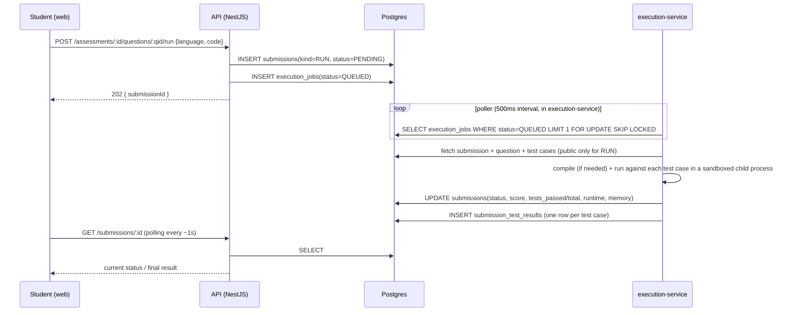

# Coding Engine — Editor, Execution, Evaluation

## 1. Editor (frontend)

Monaco Editor embedded in `apps/web`, configured per the spec:
- Syntax highlighting + line numbers (native Monaco).
- Language selector limited to the question's `supported_languages` (C++, Java, Python at MVP; the selector is driven by the `programming_language` enum so adding C/JavaScript later is a config + enum change, not a UI rewrite).
- Panels: problem statement / examples / constraints (left), editor (center), console + test case results (bottom/right) — a 3-pane layout, matching "enough screen space for problem, editor, console, test results."
- Actions: **Run** (public test cases only) and **Submit** (public + hidden), both async — see §3.
- Result rendering: per-test-case pass/fail list, runtime, memory, and — on failure — the error category (`WRONG_ANSWER`, `COMPILATION_ERROR`, etc.) with compiler/runtime error text for `COMPILATION_ERROR`/`RUNTIME_ERROR` (sanitized, see §5).

The editor persists in-progress code to `localStorage` per `(attemptId, questionId, language)` as a client-side convenience against accidental tab close — this is UX only; the authoritative record is whatever was last `RUN`/`SUBMIT`-ted to the server.

## 2. Why code execution must not run inside the API process

Student code is untrusted input. Running it in-process (even via a "sandboxed" `vm` module or similar) shares the Node process, filesystem, environment variables (including `DATABASE_URL`, JWT secrets, the Gemini API key), and network access with the main API. A single sandbox-escape or misconfigured limit compromises the entire platform, not just one exam. The spec is explicit about this, and it matches how every real judge system (Codeforces, LeetCode, HackerRank) is built: execution is always a separately privileged, separately deployed component.

## 3. Architecture



- **Separate process, separate deploy unit.** `apps/execution-service` is its own `npm` package with its own entrypoint (`node dist/server.js`), run as its own OS process (in production, its own systemd unit / Windows service — not a thread or child module of the API).
- **Communication is DB-mediated for job handoff**, plus a thin internal HTTP endpoint (`POST /internal/execution/notify`, bound to `127.0.0.1` only, authenticated with a shared secret from env) that the API calls after inserting a job — this lets the execution service react immediately instead of relying purely on poll latency, while the Postgres row remains the source of truth (so a missed notification just means the next poll tick picks it up; nothing is lost).
- **No Redis/queue broker.** `execution_jobs` with `FOR UPDATE SKIP LOCKED` gives safe concurrent job claiming across multiple worker instances of the execution service without a second infrastructure dependency. See §7 for when this should be revisited.
- The execution service holds its **own** restricted Postgres role/connection (`execution_service` DB user) that can only read `submissions`/`coding_questions`/`coding_test_cases`/`coding_question_languages` and write `submissions`/`submission_test_results`/`execution_jobs`. It has no grants on `users`, `assessments`, or anything holding PII or exam configuration — see `security.md`.

## 4. Sandbox (no Docker)

`apps/execution-service/src/sandbox/ProcessSandbox.ts` implements a `Sandbox` interface:

```ts
interface Sandbox {
  run(input: {
    language: 'CPP' | 'JAVA' | 'PYTHON';
    sourceCode: string;
    stdin: string;
    timeLimitSeconds: number;
    memoryLimitMb: number;
  }): Promise<{
    verdict: 'OK' | 'TIME_LIMIT_EXCEEDED' | 'MEMORY_LIMIT_EXCEEDED' | 'RUNTIME_ERROR' | 'COMPILATION_ERROR' | 'INTERNAL_ERROR';
    stdout: string;
    stderr: string;
    runtimeMs: number;
    memoryKb: number;
  }>;
}
```

MVP implementation (`ProcessSandbox`), per language runner:

1. **Isolated temp workspace**: each run gets a fresh directory under the OS temp path (`fs.mkdtemp`), deleted after the run — no submission ever touches a shared filesystem location.
2. **Compile step** (C++: `g++`, Java: `javac`) with its own timeout, output captured; a non-zero exit or stderr with a nonempty diagnostic → `COMPILATION_ERROR`, execution skipped, no stdin ever run.
3. **Execute step** via Node `child_process.spawn`, never `exec`/`shell: true` (no shell interpolation of student code — code is written to a file, never passed as a command-line string), with:
   - **Timeout**: `question.time_limit_seconds` (+ a small fixed grace margin for interpreter/JVM startup), enforced with `child.kill('SIGKILL')` on expiry via a Node timer — cross-platform, does not depend on OS-level `ulimit`.
   - **Memory limit**: language-appropriate flag where the runtime supports it (`java -Xmx<memory_limit_mb>m`), plus periodic RSS polling of the child PID (`ps`/`/proc` on Linux, or a Windows-safe fallback) as a backstop that kills the process if it exceeds the configured ceiling — Node has no built-in cross-platform hard memory cap for arbitrary child processes, so this is a monitored soft-enforcement, explicitly documented as a known limitation (see §6).
   - **No network access**: on Linux deployment, the runner drops the child into a restricted environment (`env: {}` — no inherited secrets, no `DATABASE_URL`/API keys ever placed in the child's env) and, where the host allows it, runs under a dedicated unprivileged, home-less OS account with an outbound-deny firewall rule; on Windows dev, at minimum the child's environment block is stripped to the empty set, which alone prevents any credential leakage into student code even though it does not fully block network syscalls.
   - **Process limits**: no fork bombs — spawned with `detached: false` so the whole process tree is killed together, and (on Linux) `ulimit -u` applied via a small shell wrapper the child is spawned through, capping the max processes the student's code tree can create.
   - stdin piped in; stdout/stderr captured up to a size cap (e.g. 1 MB) to prevent a runaway `print` loop from exhausting memory in the execution-service itself.
4. Runner resolves toolchain paths from environment variables (`CPP_COMPILER_PATH`, `JAVA_HOME`, `PYTHON_PATH`) rather than assuming `PATH` — required because this dev machine has no `g++` and a non-standard Python alias; see `implementation-plan.md` risks.

This implementation is intentionally named and interfaced (`Sandbox`) so it can be swapped for a hardened alternative — a dedicated judge sandbox (`isolate`, `nsjail`, `firejail` on Linux), a remote code-execution service, or a university-managed execution server — by writing a new class that satisfies the same interface. **No other part of the codebase depends on `ProcessSandbox` directly**; the worker depends on the `Sandbox` interface, injected at startup.

## 5. Test case evaluation

For each test case (public-only for `RUN`, public+hidden for `SUBMIT`):
1. Sandbox `run()` with the test case's `input` as stdin.
2. Compare `stdout` (trimmed, trailing-whitespace-normalized per line) against `expected_output`.
3. Map to a `submission_test_results` row: `passed`, `runtime_ms`, `memory_kb`, and (only if `is_hidden = false`) `actual_output` — hidden test case actual output is **never stored in a field the student-facing DTO reads**, only `passed`/`runtime_ms` are exposed for hidden cases.
4. Submission-level `status` is derived from the worst-case result across all executed test cases, in priority order: `COMPILATION_ERROR` > `RUNTIME_ERROR` > `TIME_LIMIT_EXCEEDED` > `MEMORY_LIMIT_EXCEEDED` > `WRONG_ANSWER` > `ACCEPTED`. `INTERNAL_ERROR` is reserved for sandbox/infra failures (e.g. the execution-service itself throwing) and always triggers a retry (`execution_jobs.attempt_count`, up to 2 retries) before surfacing to the student.
5. Error messages returned to the student for `COMPILATION_ERROR`/`RUNTIME_ERROR` are the raw compiler/runtime stderr — this is safe because it describes the student's own code, not platform internals; it is still length-capped and stripped of absolute filesystem paths before storage.

**Gemini is never involved in correctness determination** — the execution engine's stdout comparison is the sole source of truth for pass/fail, per the spec's explicit requirement.

## 6. Known limitations of the MVP sandbox (documented, not hidden)

- Memory enforcement is monitored/soft (RSS polling), not a hard kernel-enforced cgroup limit — a very fast allocation spike could exceed the limit briefly before being caught. Acceptable for an MVP on a trusted-network deployment; flagged in `implementation-plan.md` as a risk to revisit before any high-stakes/graded-for-credit deployment.
- Network egress blocking is best-effort on Windows dev; full enforcement (dedicated unprivileged OS user + firewall egress rule) is a Linux-deployment concern, documented as a Phase 6 production-hardening task, not deferred silently.
- These limitations are exactly why the `Sandbox` interface exists — replacing `ProcessSandbox` with a properly isolated implementation (e.g. `isolate`, a namespaced container-free jail, or a managed remote judge) is a single-class swap.

## 7. Scaling note (not built now)

If concurrent Run/Submit volume during a live exam window exceeds what a handful of `execution-service` worker processes polling Postgres can drain in near-real-time, the job table can be swapped for a real broker (BullMQ+Redis) behind the same `Sandbox`/job-consumer boundary — the API side (`INSERT execution_jobs`) doesn't change, only what drains that queue does. Not building this now avoids taking on Redis before there's a measured need.
