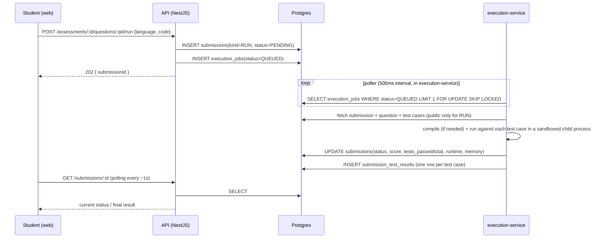

# Coding Engine — Editor, Execution, Evaluation

## 1. Editor (frontend)

Monaco Editor embedded in `apps/web`, configured per the spec:
- Syntax highlighting + line numbers (native Monaco).
- Language selector limited to the question's `supported_languages` (C++, Java, Python at MVP; the selector is driven by the `programming_language` enum so adding C/JavaScript later is a config + enum change, not a UI rewrite).
- Panels: problem statement / examples / constraints (left), editor (center), console + test case results (bottom/right) — a 3-pane layout, matching "enough screen space for problem, editor, console, test results."
- Actions: **Run** (public test cases only) and **Submit** (public + hidden), both async — see §3.
- Result rendering: per-test-case pass/fail list, runtime, memory, and — on failure — the error category (`WRONG_ANSWER`, `COMPILATION_ERROR`, etc.) with compiler/runtime error text for `COMPILATION_ERROR`/`RUNTIME_ERROR` (sanitized, see §5).

The editor persists in-progress code to `localStorage` per `(attemptId, questionId, language)` as a client-side convenience against accidental tab close — this is UX only; the authoritative record is whatever was last `RUN`/`SUBMIT`-ted to the server.

## 2. Why code execution must not run inside the API process

Student code is untrusted input. Running it in-process (even via a "sandboxed" `vm` module or similar) shares the Node process, filesystem, environment variables (including `DATABASE_URL`, JWT secrets, the Gemini API key), and network access with the main API. A single sandbox-escape or misconfigured limit compromises the entire platform, not just one exam. The spec is explicit about this, and it matches how every real judge system (Codeforces, LeetCode, HackerRank) is built: execution is always a separately privileged, separately deployed component.

## 3. Architecture



- **Separate process, separate deploy unit.** `apps/execution-service` is its own `npm` package with its own entrypoint (`node dist/server.js`), run as its own OS process (in production, its own systemd unit / Windows service — not a thread or child module of the API).
- **Communication is DB-mediated for job handoff**, plus a thin internal HTTP endpoint (`POST /internal/execution/notify`, bound to `127.0.0.1` only, authenticated with a shared secret from env) that the API calls after inserting a job — this lets the execution service react immediately instead of relying purely on poll latency, while the Postgres row remains the source of truth (so a missed notification just means the next poll tick picks it up; nothing is lost).
- **No Redis/queue broker.** `execution_jobs` with `FOR UPDATE SKIP LOCKED` gives safe concurrent job claiming across multiple worker instances of the execution service without a second infrastructure dependency. See §7 for when this should be revisited.
- The execution service holds its **own** restricted Postgres role/connection (`execution_service` DB user) that can only read `submissions`/`coding_questions`/`coding_test_cases`/`coding_question_languages` and write `submissions`/`submission_test_results`/`execution_jobs`. It has no grants on `users`, `assessments`, or anything holding PII or exam configuration — see `security.md`.

## 4. Sandbox (no Docker)

`apps/execution-service/src/sandbox/ProcessSandbox.ts` implements a `Sandbox` interface:

```ts
interface Sandbox {
  run(input: {
    language: 'CPP' | 'JAVA' | 'PYTHON';
    sourceCode: string;
    stdin: string;
    timeLimitSeconds: number;
    memoryLimitMb: number;
  }): Promise<{
    verdict: 'OK' | 'TIME_LIMIT_EXCEEDED' | 'MEMORY_LIMIT_EXCEEDED' | 'RUNTIME_ERROR' | 'COMPILATION_ERROR' | 'INTERNAL_ERROR';
    stdout: string;
    stderr: string;
    runtimeMs: number;
    memoryKb: number;
  }>;
}
```

MVP implementation (`ProcessSandbox`), per language runner:

1. **Isolated temp workspace**: each run gets a fresh directory under the OS temp path (`fs.mkdtemp`), deleted after the run — no submission ever touches a shared filesystem location.
2. **Compile step** (C++: `g++`, Java: `javac`) with its own timeout, output captured; a non-zero exit or stderr with a nonempty diagnostic → `COMPILATION_ERROR`, execution skipped, no stdin ever run.
3. **Execute step** via Node `child_process.spawn`, never `exec`/`shell: true` (no shell interpolation of student code — code is written to a file, never passed as a command-line string), with:
   - **Timeout**: `question.time_limit_seconds` (+ a small fixed grace margin for interpreter/JVM startup), enforced with a Node timer that kills the child on expiry — cross-platform, does not depend on OS-level `ulimit`. On POSIX the child is spawned `detached: true` (its own process group) and killed via `process.kill(-pid, 'SIGKILL')`, so a subprocess the submission forked/exec'd dies with it too, not just the immediate process; on Windows, `taskkill /pid <pid> /T /F` does the equivalent tree-kill. (Phase 13 hardening — the original single-pid `process.kill()` left forked grandchildren running past a timeout on Linux.)
   - **Memory limit**: Java gets a real, JVM-enforced `-Xmx<memory_limit_mb>m`. C++ and Python get a kernel-enforced `ulimit -v` (virtual-memory) ceiling via a fixed-script `sh -c` wrapper (no shell interpolation of student-controlled values — the script text never changes, command/args are passed as separate argv entries), with a startup-overhead buffer added on top of the question's configured limit (+16MB for a native C++ binary's loader/libc overhead, +128MB for CPython's interpreter/allocator-arena overhead) so the limit doesn't false-positive on interpreter boot. This is a real hard ceiling (Phase 13 — previously C++/Python had no memory limit of any kind; the "RSS-polling backstop" once described here was never actually implemented). It's still not a precise accounting of the student program's own usage — `ulimit -v` caps virtual address space, not resident memory, so it's a generous ceiling rather than an exact match to `memory_limit_mb` — and it's POSIX-only (a no-op on Windows dev machines).
   - **No network access**: nothing in this codebase restricts outbound sockets from the student process — no firewall rule, no proxy, no `iptables`/`netsh` invocation. The only mitigation implemented is environment stripping (`env: {}` — no `DATABASE_URL`/API keys/shared secret ever placed in the child's env), which prevents *credential* leakage but not network access itself. Full egress blocking (dedicated unprivileged OS user + firewall egress rule) is a Linux-deployment concern, not yet built — see §6.
   - stdin piped in; stdout/stderr captured chunk-by-chunk with a running byte counter, up to a size cap (default 1 MB combined) — the process is killed the moment the cap is crossed, so a runaway `print` loop can't buffer unbounded output in the execution-service's own memory.
4. Runner resolves toolchain paths from environment variables (`CPP_COMPILER_PATH`, `JAVA_HOME`, `PYTHON_PATH`) rather than assuming `PATH` — required because this dev machine has no `g++` and a non-standard Python alias; see `implementation-plan.md` risks.

This implementation is intentionally named and interfaced (`Sandbox`) so it can be swapped for a hardened alternative — a dedicated judge sandbox (`isolate`, `nsjail`, `firejail` on Linux), a remote code-execution service, or a university-managed execution server — by writing a new class that satisfies the same interface. **No other part of the codebase depends on `ProcessSandbox` directly**; the worker depends on the `Sandbox` interface, injected at startup.

## 5. Test case evaluation

For each test case (public-only for `RUN`, public+hidden for `SUBMIT`):
1. Sandbox `run()` with the test case's `input` as stdin.
2. Compare `stdout` (trimmed, trailing-whitespace-normalized per line) against `expected_output`.
3. Map to a `submission_test_results` row: `passed`, `runtime_ms`, `memory_kb`, and (only if `is_hidden = false`) `actual_output` — hidden test case actual output is **never stored in a field the student-facing DTO reads**, only `passed`/`runtime_ms` are exposed for hidden cases.
4. Submission-level `status` is derived from the worst-case result across all executed test cases, in priority order: `COMPILATION_ERROR` > `RUNTIME_ERROR` > `TIME_LIMIT_EXCEEDED` > `MEMORY_LIMIT_EXCEEDED` > `WRONG_ANSWER` > `ACCEPTED`. `INTERNAL_ERROR` is reserved for sandbox/infra failures (e.g. the execution-service itself throwing) and always triggers a retry (`execution_jobs.attempt_count`, up to 2 retries) before surfacing to the student.
5. Error messages returned to the student for `COMPILATION_ERROR`/`RUNTIME_ERROR` are the raw compiler/runtime stderr — this is safe because it describes the student's own code, not platform internals; it is still length-capped and stripped of absolute filesystem paths before storage.

**Gemini is never involved in correctness determination** — the execution engine's stdout comparison is the sole source of truth for pass/fail, per the spec's explicit requirement.

## 6. Known limitations of the MVP sandbox (documented, not hidden)

- **No filesystem sandboxing.** There is no chroot, jail, container, or restricted ACL — the child process runs with whatever filesystem permissions the execution-service's own OS user has. Env-var secrets are stripped (see §4), so a submission can't read `process.env.DATABASE_URL`, but nothing stops it from simply *opening files* the OS account can read — e.g. a Python submission doing `print(open('/path/to/.env').read())` — and the contents come back as ordinary stdout, capped only by the output-size limit, not filtered by content. This is a genuine residual risk of the "no Docker, OS-process isolation only" design, and it means **production deployment depends on running the execution-service under a dedicated, unprivileged, home-less OS account with no read access to `.env` files, source code, or anything else sensitive on the host** — that account is a deployment-time responsibility, not something this codebase provisions or verifies. Flagged here explicitly (it was previously an unlisted gap) rather than implied by the "no Docker" tradeoff alone.
- **No network egress blocking** — a submission can make arbitrary outbound HTTP/DNS/socket calls; nothing in this codebase restricts it (see §4). Combined with the filesystem point above, a sufficiently motivated submission could in principle read a locally-readable file and exfiltrate it over the network. The only mitigations today are environment-variable stripping (no credentials to read from `process.env` in the first place) and the same dedicated-unprivileged-account requirement — a firewall egress rule on that account is a Linux-deployment task, not yet built.
- **Memory limit is a generous virtual-address-space ceiling (`ulimit -v`), not a precise resident-memory measurement** — see §4. This is a real, kernel-enforced cap (Phase 13), but the reported `memoryKb` for C++/Python submissions is still `null` (this sandbox has no reliable way to *measure* actual usage, only to cap it).
- These limitations are exactly why the `Sandbox` interface exists — replacing `ProcessSandbox` with a properly isolated implementation (e.g. `isolate`, `nsjail`, `firejail`, a namespaced container-free jail, or a managed remote judge) is a single-class swap, and is the recommended next step before any high-stakes/graded-for-credit deployment at scale.

## 7. Scaling note (not built now)

If concurrent Run/Submit volume during a live exam window exceeds what a handful of `execution-service` worker processes polling Postgres can drain in near-real-time, the job table can be swapped for a real broker (BullMQ+Redis) behind the same `Sandbox`/job-consumer boundary — the API side (`INSERT execution_jobs`) doesn't change, only what drains that queue does. Not building this now avoids taking on Redis before there's a measured need.
