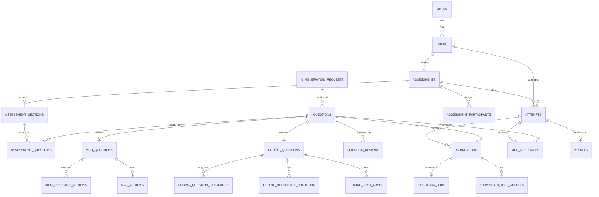

# Database Schema — PostgreSQL

## 0. Setup note

No PostgreSQL instance was found on this machine. Phase 1 setup will require installing PostgreSQL 16+ locally (or pointing `DATABASE_URL` at a remote instance) before `prisma migrate dev` can run. This is tracked in `implementation-plan.md`.

## 1. Design principles

- Fully normalized relational schema. JSON columns are used only where the data is genuinely semi-structured and not queried relationally (e.g. a coding question's `examples`, or an AI request's raw provider response for audit purposes) — never as a substitute for foreign keys.
- Every table has `id` (uuid, default `gen_random_uuid()`), `created_at`, `updated_at` unless noted.
- Enums are native Postgres enums (via Prisma `enum`).
- Soft state transitions (assessment status, question approval status, submission status) are enums with an accompanying audit table where history matters (`question_reviews`).
- Hidden test case data (`coding_test_cases.is_hidden = true`) and `coding_reference_solutions` are never selected by any student-facing query path — enforced at the Prisma query/service layer (see `security.md`).

## 2. Entity relationship diagram



## 3. Enums

```sql
CREATE TYPE user_role_code       AS ENUM ('ADMIN', 'STUDENT');            -- FACULTY added later via roles table row, not enum edit
CREATE TYPE assessment_status    AS ENUM ('DRAFT', 'PUBLISHED', 'ACTIVE', 'COMPLETED', 'ARCHIVED');
CREATE TYPE section_type         AS ENUM ('CODING', 'MCQ');
CREATE TYPE question_type        AS ENUM ('CODING', 'MCQ');
CREATE TYPE question_source      AS ENUM ('MANUAL', 'AI_GENERATED');
CREATE TYPE approval_status      AS ENUM ('PENDING_REVIEW', 'APPROVED', 'REJECTED', 'NEEDS_EDIT');
CREATE TYPE difficulty_level     AS ENUM ('EASY', 'MEDIUM', 'HARD');
CREATE TYPE programming_language AS ENUM ('CPP', 'JAVA', 'PYTHON');       -- extend with 'C', 'JAVASCRIPT' later
CREATE TYPE mcq_type             AS ENUM ('SINGLE_CHOICE', 'MULTIPLE_CHOICE', 'CODE_OUTPUT', 'SCENARIO');
CREATE TYPE attempt_status       AS ENUM ('IN_PROGRESS', 'SUBMITTED', 'AUTO_SUBMITTED', 'EXPIRED');
CREATE TYPE submission_kind      AS ENUM ('RUN', 'SUBMIT');
CREATE TYPE submission_status    AS ENUM ('PENDING', 'RUNNING', 'ACCEPTED', 'WRONG_ANSWER',
                                           'COMPILATION_ERROR', 'RUNTIME_ERROR',
                                           'TIME_LIMIT_EXCEEDED', 'MEMORY_LIMIT_EXCEEDED', 'INTERNAL_ERROR');
CREATE TYPE execution_job_status AS ENUM ('QUEUED', 'RUNNING', 'COMPLETED', 'FAILED');
CREATE TYPE ai_request_status    AS ENUM ('PENDING', 'SUCCESS', 'FAILED');
CREATE TYPE participant_source   AS ENUM ('DIRECT', 'GROUP');
```

## 4. Core tables (DDL)

```sql
-- ============ Identity & Roles ============

CREATE TABLE roles (
    id          UUID PRIMARY KEY DEFAULT gen_random_uuid(),
    code        user_role_code NOT NULL UNIQUE,   -- 'ADMIN' | 'STUDENT' (add 'FACULTY' row later; enum extended via migration when needed)
    name        TEXT NOT NULL,
    created_at  TIMESTAMPTZ NOT NULL DEFAULT now()
);

CREATE TABLE users (
    id              UUID PRIMARY KEY DEFAULT gen_random_uuid(),
    external_id     TEXT UNIQUE,                  -- id from the future Centurion platform / SSO; NULL until integrated
    email           CITEXT NOT NULL UNIQUE,
    password_hash   TEXT,                         -- NULL once auth is fully delegated to external SSO
    name            TEXT NOT NULL,
    role_id         UUID NOT NULL REFERENCES roles(id),
    department      TEXT,
    batch           TEXT,
    is_active       BOOLEAN NOT NULL DEFAULT true,
    created_at      TIMESTAMPTZ NOT NULL DEFAULT now(),
    updated_at      TIMESTAMPTZ NOT NULL DEFAULT now()
);
CREATE INDEX idx_users_role ON users(role_id);
CREATE INDEX idx_users_department_batch ON users(department, batch);

-- ============ Question Bank (shared parent) ============

CREATE TABLE questions (
    id               UUID PRIMARY KEY DEFAULT gen_random_uuid(),
    type             question_type NOT NULL,
    title            TEXT NOT NULL,
    difficulty       difficulty_level NOT NULL,
    topics           TEXT[] NOT NULL DEFAULT '{}',
    tags             TEXT[] NOT NULL DEFAULT '{}',
    marks            NUMERIC(6,2) NOT NULL,
    source           question_source NOT NULL DEFAULT 'MANUAL',
    approval_status  approval_status NOT NULL DEFAULT 'APPROVED', -- MANUAL defaults to APPROVED; AI_GENERATED forced to PENDING_REVIEW at insert (app-layer rule)
    created_by       UUID NOT NULL REFERENCES users(id),
    created_at       TIMESTAMPTZ NOT NULL DEFAULT now(),
    updated_at       TIMESTAMPTZ NOT NULL DEFAULT now()
);
CREATE INDEX idx_questions_type_status ON questions(type, approval_status);
CREATE INDEX idx_questions_topics ON questions USING GIN(topics);
CREATE INDEX idx_questions_difficulty ON questions(difficulty);

-- ============ Coding question detail ============

CREATE TABLE coding_questions (
    question_id         UUID PRIMARY KEY REFERENCES questions(id) ON DELETE CASCADE,
    problem_statement   TEXT NOT NULL,
    input_format        TEXT NOT NULL,
    output_format       TEXT NOT NULL,
    constraints         TEXT[] NOT NULL DEFAULT '{}',
    examples            JSONB NOT NULL DEFAULT '[]',   -- [{ input, output, explanation }] — genuinely semi-structured display data
    time_limit_seconds  NUMERIC(5,2) NOT NULL DEFAULT 2,
    memory_limit_mb     INTEGER NOT NULL DEFAULT 256
);

CREATE TABLE coding_question_languages (
    question_id  UUID NOT NULL REFERENCES coding_questions(question_id) ON DELETE CASCADE,
    language     programming_language NOT NULL,
    PRIMARY KEY (question_id, language)
);

CREATE TABLE coding_reference_solutions (
    id           UUID PRIMARY KEY DEFAULT gen_random_uuid(),
    question_id  UUID NOT NULL REFERENCES coding_questions(question_id) ON DELETE CASCADE,
    language     programming_language NOT NULL,
    code         TEXT NOT NULL,
    UNIQUE (question_id, language)
);

CREATE TABLE coding_test_cases (
    id            UUID PRIMARY KEY DEFAULT gen_random_uuid(),
    question_id   UUID NOT NULL REFERENCES coding_questions(question_id) ON DELETE CASCADE,
    is_hidden     BOOLEAN NOT NULL DEFAULT false,
    input         TEXT NOT NULL,
    expected_output TEXT NOT NULL,
    order_index   INTEGER NOT NULL DEFAULT 0,
    weight        NUMERIC(5,2) NOT NULL DEFAULT 1,   -- reserved for future partial scoring; MVP ignores it (all-or-nothing)
    created_at    TIMESTAMPTZ NOT NULL DEFAULT now()
);
CREATE INDEX idx_test_cases_question ON coding_test_cases(question_id);

-- ============ MCQ detail ============

CREATE TABLE mcq_questions (
    question_id             UUID PRIMARY KEY REFERENCES questions(id) ON DELETE CASCADE,
    mcq_type                mcq_type NOT NULL,
    question_text           TEXT NOT NULL,
    code_snippet            TEXT,
    explanation             TEXT,
    negative_marking_value  NUMERIC(5,2) NOT NULL DEFAULT 0
);

CREATE TABLE mcq_options (
    id            UUID PRIMARY KEY DEFAULT gen_random_uuid(),
    question_id   UUID NOT NULL REFERENCES mcq_questions(question_id) ON DELETE CASCADE,
    option_text   TEXT NOT NULL,
    is_correct    BOOLEAN NOT NULL DEFAULT false,
    order_index   INTEGER NOT NULL DEFAULT 0
);
CREATE INDEX idx_mcq_options_question ON mcq_options(question_id);

-- ============ AI generation & review ============

CREATE TABLE ai_generation_requests (
    id                 UUID PRIMARY KEY DEFAULT gen_random_uuid(),
    requested_by       UUID NOT NULL REFERENCES users(id),
    section_type       question_type NOT NULL DEFAULT 'CODING',
    topic              TEXT NOT NULL,
    difficulty         difficulty_level NOT NULL,
    count_requested    INTEGER NOT NULL,
    language_hint      programming_language,
    marks_hint         NUMERIC(6,2),
    time_limit_hint    NUMERIC(5,2),
    memory_limit_hint  INTEGER,
    prompt_snapshot    TEXT NOT NULL,          -- exact prompt sent, for auditability/debugging
    raw_response       JSONB,                  -- raw provider response, for audit; never surfaced to students
    status             ai_request_status NOT NULL DEFAULT 'PENDING',
    error_message      TEXT,
    created_at         TIMESTAMPTZ NOT NULL DEFAULT now(),
    completed_at       TIMESTAMPTZ
);

-- links a generated question back to the request that produced it
ALTER TABLE questions ADD COLUMN ai_generation_request_id UUID REFERENCES ai_generation_requests(id);

CREATE TABLE question_reviews (
    id                       UUID PRIMARY KEY DEFAULT gen_random_uuid(),
    question_id              UUID NOT NULL REFERENCES questions(id) ON DELETE CASCADE,
    reviewed_by              UUID REFERENCES users(id),
    status                   approval_status NOT NULL,
    review_notes             TEXT,
    created_at               TIMESTAMPTZ NOT NULL DEFAULT now()
);
CREATE INDEX idx_question_reviews_question ON question_reviews(question_id);

-- ============ Assessments ============

CREATE TABLE assessments (
    id             UUID PRIMARY KEY DEFAULT gen_random_uuid(),
    title          TEXT NOT NULL,
    description    TEXT,
    instructions   TEXT,
    duration_minutes INTEGER NOT NULL,
    start_at       TIMESTAMPTZ NOT NULL,
    end_at         TIMESTAMPTZ NOT NULL,
    max_marks      NUMERIC(7,2) NOT NULL DEFAULT 0,   -- denormalized sum, recomputed when questions attached
    status         assessment_status NOT NULL DEFAULT 'DRAFT',
    created_by     UUID NOT NULL REFERENCES users(id),
    created_at     TIMESTAMPTZ NOT NULL DEFAULT now(),
    updated_at     TIMESTAMPTZ NOT NULL DEFAULT now(),
    CHECK (end_at > start_at)
);
CREATE INDEX idx_assessments_status ON assessments(status);
CREATE INDEX idx_assessments_window ON assessments(start_at, end_at);

CREATE TABLE assessment_sections (
    id             UUID PRIMARY KEY DEFAULT gen_random_uuid(),
    assessment_id  UUID NOT NULL REFERENCES assessments(id) ON DELETE CASCADE,
    title          TEXT NOT NULL,
    section_type   section_type NOT NULL,
    order_index    INTEGER NOT NULL DEFAULT 0
);
CREATE INDEX idx_sections_assessment ON assessment_sections(assessment_id);

CREATE TABLE assessment_questions (
    id             UUID PRIMARY KEY DEFAULT gen_random_uuid(),
    section_id     UUID NOT NULL REFERENCES assessment_sections(id) ON DELETE CASCADE,
    question_id    UUID NOT NULL REFERENCES questions(id),
    marks_override NUMERIC(6,2),                -- NULL = use questions.marks
    order_index    INTEGER NOT NULL DEFAULT 0,
    UNIQUE (section_id, question_id)
);
CREATE INDEX idx_assessment_questions_section ON assessment_questions(section_id);
CREATE INDEX idx_assessment_questions_question ON assessment_questions(question_id);

CREATE TABLE assessment_participants (
    id             UUID PRIMARY KEY DEFAULT gen_random_uuid(),
    assessment_id  UUID NOT NULL REFERENCES assessments(id) ON DELETE CASCADE,
    user_id        UUID NOT NULL REFERENCES users(id),
    source         participant_source NOT NULL DEFAULT 'DIRECT',
    group_label    TEXT,                        -- e.g. "CSE-2026-A" if assigned via batch/department filter
    assigned_at    TIMESTAMPTZ NOT NULL DEFAULT now(),
    UNIQUE (assessment_id, user_id)
);
CREATE INDEX idx_participants_assessment ON assessment_participants(assessment_id);
CREATE INDEX idx_participants_user ON assessment_participants(user_id);

-- ============ Attempts & Submissions ============

CREATE TABLE attempts (
    id             UUID PRIMARY KEY DEFAULT gen_random_uuid(),
    assessment_id  UUID NOT NULL REFERENCES assessments(id),
    user_id        UUID NOT NULL REFERENCES users(id),
    started_at     TIMESTAMPTZ NOT NULL DEFAULT now(),
    ends_at        TIMESTAMPTZ NOT NULL,          -- computed server-side = min(started_at + duration, assessment.end_at) at start time
    submitted_at   TIMESTAMPTZ,
    status         attempt_status NOT NULL DEFAULT 'IN_PROGRESS',
    created_at     TIMESTAMPTZ NOT NULL DEFAULT now(),
    UNIQUE (assessment_id, user_id)               -- one attempt per student per assessment (MVP rule)
);
CREATE INDEX idx_attempts_assessment ON attempts(assessment_id);
CREATE INDEX idx_attempts_user ON attempts(user_id);
CREATE INDEX idx_attempts_status_ends_at ON attempts(status, ends_at);  -- for the expiry sweep job

CREATE TABLE submissions (
    id             UUID PRIMARY KEY DEFAULT gen_random_uuid(),
    attempt_id     UUID NOT NULL REFERENCES attempts(id) ON DELETE CASCADE,
    question_id    UUID NOT NULL REFERENCES coding_questions(question_id),
    kind           submission_kind NOT NULL,       -- RUN or SUBMIT
    language       programming_language NOT NULL,
    code           TEXT NOT NULL,
    status         submission_status NOT NULL DEFAULT 'PENDING',
    score          NUMERIC(6,2) NOT NULL DEFAULT 0,
    tests_passed   INTEGER NOT NULL DEFAULT 0,
    tests_total    INTEGER NOT NULL DEFAULT 0,
    runtime_ms     INTEGER,
    memory_kb      INTEGER,
    error_message  TEXT,                            -- compiler/runtime error, sanitized before returning to student
    created_at     TIMESTAMPTZ NOT NULL DEFAULT now(),
    completed_at   TIMESTAMPTZ
);
CREATE INDEX idx_submissions_attempt_question ON submissions(attempt_id, question_id);
CREATE INDEX idx_submissions_status ON submissions(status);

CREATE TABLE submission_test_results (
    id             UUID PRIMARY KEY DEFAULT gen_random_uuid(),
    submission_id  UUID NOT NULL REFERENCES submissions(id) ON DELETE CASCADE,
    test_case_id   UUID NOT NULL REFERENCES coding_test_cases(id),
    is_hidden      BOOLEAN NOT NULL,               -- denormalized for fast student-facing filtering
    passed         BOOLEAN NOT NULL,
    actual_output  TEXT,                           -- only returned to student when is_hidden = false
    runtime_ms     INTEGER,
    memory_kb      INTEGER,
    error_message  TEXT,
    order_index    INTEGER NOT NULL DEFAULT 0
);
CREATE INDEX idx_test_results_submission ON submission_test_results(submission_id);

CREATE TABLE execution_jobs (
    id             UUID PRIMARY KEY DEFAULT gen_random_uuid(),
    submission_id  UUID NOT NULL UNIQUE REFERENCES submissions(id) ON DELETE CASCADE,
    status         execution_job_status NOT NULL DEFAULT 'QUEUED',
    attempt_count  INTEGER NOT NULL DEFAULT 0,
    created_at     TIMESTAMPTZ NOT NULL DEFAULT now(),
    started_at     TIMESTAMPTZ,
    completed_at   TIMESTAMPTZ
);
CREATE INDEX idx_execution_jobs_status ON execution_jobs(status, created_at);

-- ============ MCQ responses ============

CREATE TABLE mcq_responses (
    id             UUID PRIMARY KEY DEFAULT gen_random_uuid(),
    attempt_id     UUID NOT NULL REFERENCES attempts(id) ON DELETE CASCADE,
    question_id    UUID NOT NULL REFERENCES mcq_questions(question_id),
    is_correct     BOOLEAN,
    score          NUMERIC(6,2) NOT NULL DEFAULT 0,
    answered_at    TIMESTAMPTZ NOT NULL DEFAULT now(),
    UNIQUE (attempt_id, question_id)
);

CREATE TABLE mcq_response_options (
    response_id    UUID NOT NULL REFERENCES mcq_responses(id) ON DELETE CASCADE,
    option_id      UUID NOT NULL REFERENCES mcq_options(id),
    PRIMARY KEY (response_id, option_id)
);

-- ============ Results ============

CREATE TABLE results (
    id                    UUID PRIMARY KEY DEFAULT gen_random_uuid(),
    attempt_id            UUID NOT NULL UNIQUE REFERENCES attempts(id) ON DELETE CASCADE,
    assessment_id         UUID NOT NULL REFERENCES assessments(id),
    user_id               UUID NOT NULL REFERENCES users(id),
    total_score           NUMERIC(7,2) NOT NULL DEFAULT 0,
    max_score             NUMERIC(7,2) NOT NULL DEFAULT 0,
    percentage            NUMERIC(5,2) NOT NULL DEFAULT 0,
    coding_score          NUMERIC(7,2) NOT NULL DEFAULT 0,
    mcq_score             NUMERIC(7,2) NOT NULL DEFAULT 0,
    questions_attempted   INTEGER NOT NULL DEFAULT 0,
    questions_solved      INTEGER NOT NULL DEFAULT 0,
    time_taken_seconds    INTEGER NOT NULL DEFAULT 0,
    submission_count      INTEGER NOT NULL DEFAULT 0,
    rank                  INTEGER,                 -- recomputed per-assessment on finalize; nullable until then
    finalized_at          TIMESTAMPTZ NOT NULL DEFAULT now()
);
CREATE INDEX idx_results_assessment_rank ON results(assessment_id, rank);
CREATE INDEX idx_results_user ON results(user_id);
```

## 5. Why this shape

- **`questions` + detail tables** (`coding_questions`/`mcq_questions`) instead of one wide table: shared fields (difficulty, topics, marks, approval workflow) live once; type-specific fields don't produce a table full of nullable columns. Also makes the question bank queryable as one list (`SELECT * FROM questions WHERE approval_status = 'APPROVED'`) regardless of type.
- **`assessment_questions` is a pure join** with an optional `marks_override` — a question can appear in many assessments with different marks weighting without duplicating question content, directly satisfying "an approved question can be reused in multiple assessments."
- **`coding_test_cases.weight`** exists now (default 1, unused by MVP scoring) so partial-credit scoring (§14 of the spec) is a scoring-service change later, not a migration.
- **`execution_jobs`** is the queue table for the execution service (see `coding-engine.md`) — using Postgres instead of Redis/BullMQ avoids a second infra dependency for MVP throughput.
- **`question_reviews`** is an append-only audit log; `questions.approval_status` holds current state for fast filtering. This lets the admin UI show full review history without re-deriving it from AI request logs.
- **RBAC via `roles.code`** rather than a hardcoded enum on `users` directly: adding FACULTY is `INSERT INTO roles ...` + a guard config change, not a column migration.
- Hidden test case protection is **not** a database concern (RLS was considered and rejected as unnecessary complexity given the API is the only DB client with student-facing exposure) — it's enforced in the Nest service layer via explicit DTO mapping. See `security.md`.
