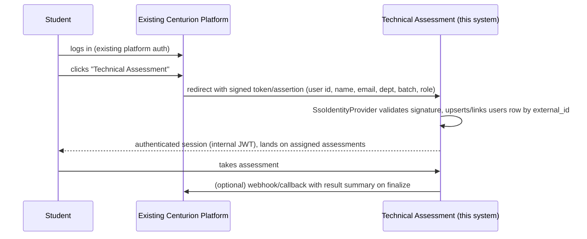

# External Platform Integration Strategy

## 1. Goal

The platform must be adoptable inside Centurion University's existing system without a rewrite: as a linked module reachable from "Academics & Activities → Technical Assessment," using the existing platform's authenticated user session, and reporting results back. Everything below exists to make that a configuration/adapter change later, not a re-architecture.

## 2. Identity abstraction

```ts
// apps/api/src/modules/auth/interfaces/identity-provider.ts
interface IdentityProvider {
  authenticate(credentials: unknown): Promise<ExternalIdentity | null>;
}

interface ExternalIdentity {
  externalId: string;   // stable id from the source system
  email: string;
  name: string;
  department?: string;
  batch?: string;
  role: 'ADMIN' | 'STUDENT';
}
```

- **MVP implementation**: `LocalIdentityProvider` — email + bcrypt password check against `users.password_hash`, `externalId = users.id` (self-referential until a real external system exists).
- **Future implementation**: `SsoIdentityProvider` — validates a token/assertion from Centurion's SSO (OAuth2/OIDC or SAML, whichever the existing platform uses) and maps its claims onto the same `ExternalIdentity` shape.
- `users.external_id` exists **from the first migration** (nullable, unique) specifically so that when SSO arrives, existing local accounts can be linked to their external identity by a one-time backfill rather than a schema change.
- `AuthService` depends on `IdentityProvider` via DI, exactly like `AIProvider`/`Sandbox` — swapping identity sources doesn't touch `AssessmentsService`, `SubmissionsService`, or any RBAC guard, because those all operate on the internal `users.id`/`role`, never on the raw credential mechanism.

## 3. Planned SSO handoff flow (not built in MVP, designed for)



The exact protocol (OIDC redirect, SAML POST binding, or a simpler signed-JWT handoff) is intentionally undecided until the existing platform's actual auth stack is known — the `IdentityProvider` interface is protocol-agnostic so that decision doesn't ripple through the codebase.

## 4. Result callback

`ResultsService.finalize()` (see `assessment-system.md`) is the single place a result becomes final. A future `ResultWebhookService` can hook the same finalize event (Nest event emitter, already idiomatic for cross-cutting side effects) to `POST` a result summary to a Centurion-provided callback URL, without modifying the finalize logic itself — this is called out here so the finalize step is implemented as an emitted domain event (`attempt.finalized`) from day one rather than a synchronous inline function, even though nothing currently listens for it besides the ranking recompute.

## 5. API-first, not UI-coupled

Nothing in `apps/api` assumes the `apps/web` frontend is the only client. Every capability (assign assessment, fetch questions, submit code, fetch results) is a documented REST endpoint (`api-specification.md`) that the existing Centurion platform's own frontend could call directly instead of embedding/iframing `apps/web` — both integration styles (iframe the existing SPA, or have the existing platform build its own UI against this API) remain open.

## 6. What is explicitly deferred

- Real SSO protocol implementation (OIDC/SAML client, token verification middleware) — Phase 12.
- Result webhook delivery, retry/backoff for a flaky receiving endpoint — Phase 12.
- Bulk user provisioning from the existing platform's roster (vs. today's admin-created `users` rows) — a `POST /users/bulk-import` endpoint is a natural Phase 12 addition, same shape as the AI question generation's "validate then insert" pattern.

None of these are blocked by anything built in earlier phases — that is the point of the abstraction.
